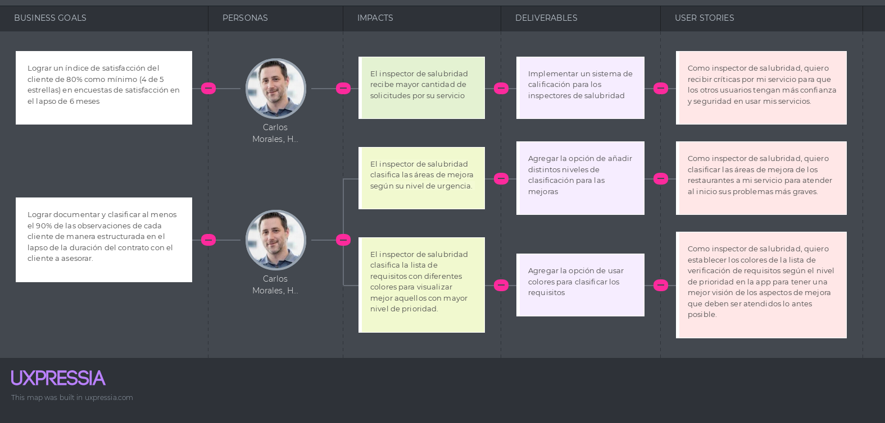
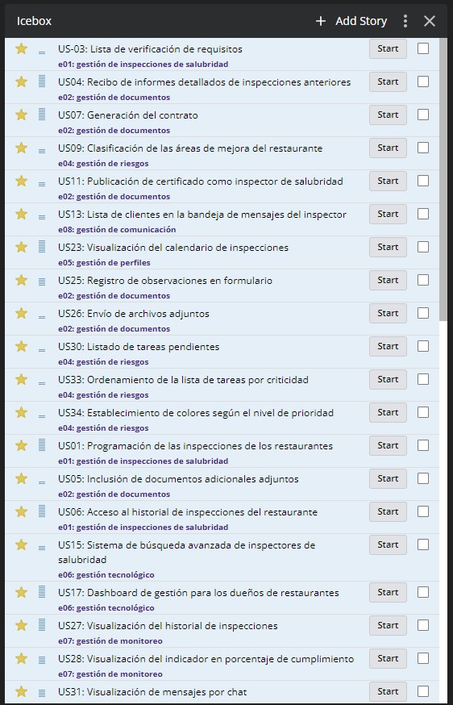
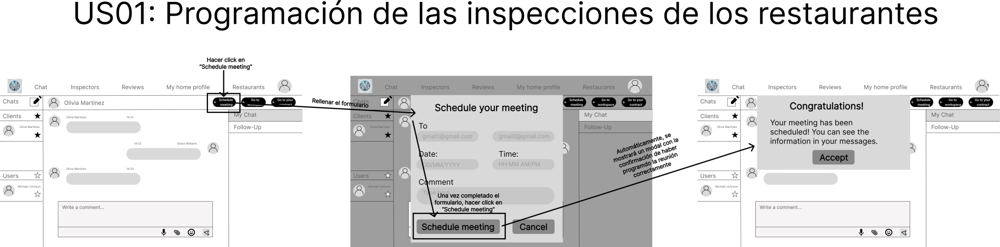
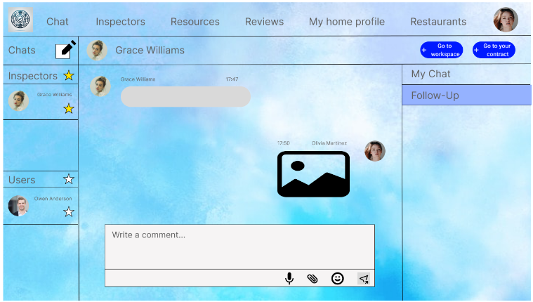
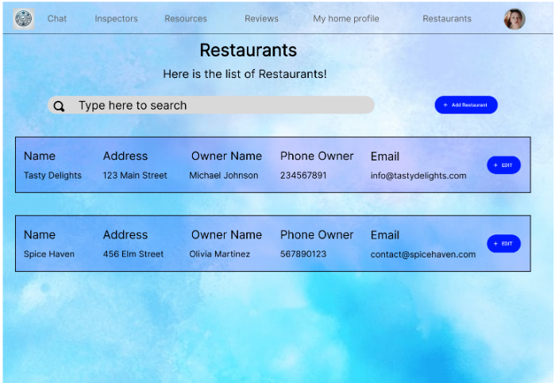

<h3 align="center"> Universidad Peruana de Ciencias Aplicadas </h3>

<h3 align="center"> Ingeniería de Software </h3>
<h3 align="center"> Ciclo 2024 - 2 </h3>

<br>

<div align="center">
  
</div>

<br>

<h1 align="center"> TF Report </h1>

<h3 align="center"> Desarrollo de Aplicaciones Open Source - WS53 </h3>

<h3 align="center"> Docente: Juan Antonio Flores Moroco </h3>

<div align="center">

| Member                           |    Code    |
| :------------------------------- | :--------: |
| Huanca Zevallos, Cristhian Joel   | U20201B914 |
| Aquino Gutierrezz, Joshep Giovani | u202022089 |
| Cossio Jimenez, Jimena Alessandra | u202117854 |
| Carbajal Santivañez, Sebastian Aaron Anibal | u202111461 |
| Sagastegui Rodriguez, Luis Jesus | u202014249 |

</div>

<h3 align="center">2024</h3>

<br><br>

# Registro de Versiones del Informe

<div align="center">

| Versión | Fecha | Autor | Descripción de modificación |
| :-----: | :---: | :---: | :-------------------------- |
|    TB1     |   03/09    |   Cristhian Joel Huanca Zevallos, Joshep Giovani Aquino Gutierrezz, Jimena Alessandra Cossio Jimenez, Sebastian Aaron Anibal Carbajal Santivañez, Luis Jesus Sagastegui Rodriguez  |     Se realizó la investigación del problema y de la solución, se realizó el Lean UX, se definió las User Stories, se realizó el Product Backlog, se elaboraron los artefactos del Needfinding, se elaboró el diseño del diagrama de clases al igual que su diccionario y relaciones. También se elaboró el diagrama de la base de datos y la landing page. |
|    TP     |   22/09    |   Cristhian Joel Huanca Zevallos, Joshep Giovani Aquino Gutierrezz, Jimena Alessandra Cossio Jimenez, Sebastian Aaron Anibal Carbajal Santivañez, Luis Jesus Sagastegui Rodriguez  |     Se realizaron modificaciones significativas en la planificación y documentación del proyecto. Se actualizó el Sprint Backlog para reflejar con claridad las prioridades y el progreso de las tareas. Se mejoró la documentación de la evidencia de desarrollo y la suite de pruebas, asegurando que los resultados fueran accesibles y comprensibles para diferentes audiencias. Además, se generó información detallada sobre los servicios utilizados, lo que facilitó la alineación entre todos los miembros del equipo. Estas modificaciones optimizaron la comunicación escrita y fortalecieron la colaboración, permitiendo una evaluación más efectiva del estado del proyecto. |

</div>

# Project Report Collaboration Insights

<div align="center">

URL del repositorio: https://github.com/Josephgag3333/ArquiAplicOpenSource-1

## TB1:

**Colaboracion global:**


**Alumno: Huanca Zevallos, Cristhian Joel**


Colaboracion: Se encargó de investigar a fondo el problema y plantear soluciones. Además, lideró el desarrollo del enfoque Lean UX, orientado a crear soluciones centradas en el usuario mediante ciclos rápidos de prueba y aprendizaje.

**Alumno: Aquino Gutierrezz, Joshep Giovani**


Colaboracion: Definió las User Stories, desglosando las necesidades del usuario en tareas concretas. También se responsabilizó de la creación del Product Backlog, organizando y priorizando las tareas a desarrollar.

**Alumno: Cossio Jimenez, Jimena Alessandra**


Colaboracion: Desarrolló los artefactos del Needfinding, utilizando técnicas para identificar las necesidades reales de los usuarios y documentarlas de manera estructurada, asegurando que la solución aborde los problemas más críticos.

**Alumno: Carbajal Santivañez, Sebastian Aaron Anibal**


Colaboracion: Elaboró el diagrama de clases, así como el diccionario de clases y las relaciones entre ellas, definiendo la estructura lógica del sistema y asegurando que las interacciones entre las clases fueran coherentes.

**Alumno: Sagastegui Rodriguez, Luis Jesus**


Colaboracion: Diseñó el diagrama de la base de datos y la arquitectura de almacenamiento de datos. Además, trabajó en la creación de la landing page, asegurando un diseño atractivo y funcional para la presentación del producto.

## TP:

**Colaboracion global:**


**Alumno: Huanca Zevallos, Cristhian Joel**


Colaboracion: Se dedicó a recopilar y documentar la evidencia de desarrollo, asegurando que cada funcionalidad implementada estuviera claramente explicada y accesible para la revisión del sprint. Su atención al detalle mejoró la calidad de la documentación.

**Alumno: Aquino Gutierrezz, Joshep Giovani**


Colaboracion: Se enfocó en diseñar y ejecutar la suite de pruebas, documentando los resultados y proponiendo mejoras en base a los hallazgos. Su trabajo fue clave para garantizar que el software cumpliera con los estándares de calidad.

**Alumno: Cossio Jimenez, Jimena Alessandra**


Colaboracion: Desarrolló los artefactos del Needfinding, utilizando técnicas para identificar las necesidades reales de los usuarios y documentarlas de manera estructurada, asegurando que la solución aborde los problemas más críticos.

**Alumno: Carbajal Santivañez, Sebastian Aaron Anibal**


Colaboracion: Se encargó de elaborar la documentación sobre los servicios utilizados en el proyecto, asegurando que todos los aspectos técnicos fueran comprensibles para diferentes rangos de audiencia. Su enfoque en la claridad facilitó la alineación del equipo.

**Alumno: Sagastegui Rodriguez, Luis Jesus**


Colaboracion: Se encargó de liderar la planificación del Sprint 2, facilitando la reunión y asegurando que todos los miembros comprendieran sus roles y responsabilidades. También actualizó el Sprint Backlog para reflejar el progreso del equipo.


</div>

<br><br>


# Informe de Startup

## Contenido

- Capítulo I: Introducción
  - 1.1. Startup Profile
    - 1.1.1. Descripción de la Startup
    - 1.1.2. Perfiles de integrantes del equipo
  - 1.2. Solution Profile
    - 1.2.1 Antecedentes y problemática
    - 1.2.2 Lean UX Process.
      - 1.2.2.1. Lean UX Problem Statements.
      - 1.2.2.2. Lean UX Assumptions.
      - 1.2.2.3. Lean UX Hypothesis Statements.
      - 1.2.2.4. Lean UX Canvas.
  - 1.3. Segmentos objetivo.
- Capítulo II: Requirements Elicitation & Analysis
  - 2.1. Competidores.
    - 2.1.1. Análisis competitivo.
    - 2.1.2. Estrategias y tácticas frente a competidores.
  - 2.2. Entrevistas.
      - 2.2.1. Diseño de entrevistas.
      - 2.2.2. Registro de entrevistas.
      - 2.2.3. Análisis de entrevistas.
  - 2.3. Needfinding.
    - 2.3.1. User Personas.
    - 2.3.2. User Task Matrix.
    - 2.3.3. User Journey Mapping.
    - 2.3.4. Empathy Mapping.
    - 2.3.5. As-is Scenario Mapping.
  - 2.4. Ubiquitous Language.
- Capítulo III: Requirements Specification
  - 3.1. To-Be Scenario Mapping.
  -  3.2. User Stories.
  - 3.3. Impact Mapping.
  - 3.4. Product Backlog.
- Capítulo IV: Product Design
  - 4.1. Style Guidelines.
  - 4.1.1. General Style Guidelines.
    - 4.1.2. Web Style Guidelines.
  - 4.2. Information Architecture.
    - 4.2.1. Organization Systems.
    - 4.2.2. Labeling Systems.
    - 4.2.3. SEO Tags and Meta Tags
    - 4.2.4. Searching Systems.
    - 4.2.5. Navigation Systems.
  - 4.3. Landing Page UI Design.
    - 4.3.1. Landing Page Wireframe.
    - 4.3.2. Landing Page Mock-up.
  - 4.4. Web Applications UX/UI Design.
    - 4.4.1. Web Applications Wireframes.
    - 4.4.2. Web Applications Wireflow Diagrams.
    - 4.4.2. Web Applications Mock-ups.
    - 4.4.3. Web Applications User Flow Diagrams.
  - 4.5. Web Applications Prototyping.
  - 4.6. Domain-Driven Software Architecture.
    - 4.6.1. Software Architecture Context Diagram.
    - 4.6.2. Software Architecture Container Diagrams.
    - 4.6.3. Software Architecture Components Diagrams.
  - 4.7. Software Object-Oriented Design.
    - 4.7.1. Class Diagrams.
    - 4.7.2. Class Dictionary.
  - 4.8. Database Design.
    - 4.8.1. Database Diagram.
- Capítulo V: Product Implementation, Validation & Deployment
  - 5.1. Software Configuration Management.
    - 5.1.1. Software Development Environment Configuration.
    - 5.1.2. Source Code Management.
    - 5.1.3. Source Code Style Guide & Conventions.
    - 5.1.4. Software Deployment Configuration.
  - 5.2. Landing Page, Services & Applications Implementation.
    - 5.2.X. Sprint n
    - 5.2.X.1. Sprint Planning n.
    - 5.2.X.2. Sprint Backlog n.
    - 5.2.X.3. Development Evidence for Sprint Review.
    - 5.2.X.4. Testing Suite Evidence for Sprint Review.
    - 5.2.X.5. Execution Evidence for Sprint Review.
    - 5.2.X.6. Services Documentation Evidence for Sprint Review.
    - 5.2.X.7. Software Deployment Evidence for Sprint Review.
    - 5.2.X.8. Team Collaboration Insights during Sprint.


# Student Outcome
<div align="center">

El curso contribuye al cumplimiento del Student Outcome ABET:
<br>
<b>ABET – EAC - Student Outcome 3</b>

<b>Criterio</b>: <i>Capacidad de comunicarse efectivamente con un rango de audiencias.</i>
<br>
En el siguiente cuadro se describe las acciones realizadas y enunciados de
conclusiones por parte del grupo, que permiten sustentar el haber alcanzado el logro
del ABET – EAC - Student Outcome 3.

<table>
<tr>
    <th><b>Criterio específico</b></th>
    <th><b>Acciones realizadas</b></th>
    <th><b>Conclusiones</b></th>
</tr>
<tr>
    <td><b>Comunica oralmente con objetividad a diferentes rangos de audiencia.</b></td>
    <td>
      <b>Huanca Zevallos, Cristhian Joel</b> </br>
      <b>TB1:</b> </br>
      Hacer entrevistas (diseño de entrevistas, registro de entrevistas y análisis de entrevistas) y participar activamente en la reunión de equipo   </br>
      <b>TP1:</b> </br>
      Encargado de documentar el proceso de planificación del segundo sprint, incluyendo objetivos y participantes. </br>
      <b>TB2:</b> </br>
      Completar </br>
      <b>TF1:</b> </br>
      Completar </br>
      <br><b>Aquino Gutierrezz, Joshep Giovani</b> </br>
      <b>TB1:</b> </br>
      Hacer entrevistas (diseño de entrevistas, registro de entrevistas y análisis de entrevistas) y participar activamente en la reunión de equipo </br>
      <b>TP1:</b> </br>
      Se encargará de recopilar y presentar los resultados de las pruebas realizadas, así como la documentación de los casos de prueba. </br>
      <b>TB2:</b> </br>
      Completar </br>
      <b>TF1:</b> </br>
      Completar </br>
      <br><b>Cossio Jimenez, Jimena Alessandra</b> </br>
      <b>TB1:</b> </br>
      Participar en la reunión de equipo y presentar la idea de manera clara </br>
      <b>TP1:</b> </br>
      Responsable de documentar la ejecución de las tareas, incluyendo capturas de pantalla y reportes de seguimiento. </br>
      <b>TB2:</b> </br>
      Completar </br>
      <b>TF1:</b> </br>
      Completar </br>
      <br><b>Carbajal Santivañez, Sebastian Aaron Anibal</b> </br>
      <b>TB1:</b> </br>
      Participar activamente en la reunión de equipo. </br>
      <b>TP1:</b> </br>
      Encargado de generar la documentación de los servicios utilizados y sus integraciones. </br>
      <b>TB2:</b> </br>
      Completar </br>
      <b>TF1:</b> </br>
      Completar </br>
      <br><b>Sagastegui Rodriguez, Luis Jesus</b> </br>
      <b>TB1:</b> </br>
      Hacer entrevistas (diseño de entrevistas, registro de entrevistas y análisis de entrevistas) y participar activamente en la reunión de equipo </br>
      <b>TP1:</b> </br>
      Documentará la evidencia de desarrollo, incluyendo ejemplos de funcionalidades implementadas y código relevante. </br>
      <b>TB2:</b> </br>
      Completar </br>
      <b>TF1:</b> </br>
      Completar </br>
    </td>
    <td>
    <b>TB1:</b> 
       </br>
    El grupo pudo iterar el trabajo conforme a los feedback que recibimos del profesor. Eso también se pudo mejorar con las opiniones que obtuvimos de las personas entrevistadas, pertenecientes a nuestros 2 segmentos objetivo.</br>
    <b>TP1:</b> 
       </br>
    Durante el Sprint 2, el equipo demostró una notable capacidad para comunicar de manera efectiva y objetiva en diversas situaciones. Las presentaciones sobre el progreso del proyecto, realizadas ante diferentes audiencias, desde compañeros hasta supervisores, fueron bien recibidas. Cada miembro del equipo adaptó su estilo de comunicación según el público, lo que facilitó la comprensión de conceptos técnicos complejos y mantuvo el interés de todos los asistentes. Esta habilidad no solo reforzó nuestra cohesión como equipo, sino que también fomentó un ambiente de colaboración y aprendizaje continuo.
    </td>
</tr>
<tr>
    <td><b>Comunica por escrito con objetividad a diferentes rangos de audiencia.</b></td>
    <td>
      <b>Huanca Zevallos, Cristhian Joel</b> </br>
      <b>TB1:</b> </br>
      Realizar el perfil de la startup y de la solución, realizar los segmentos objetivo, el análisis competitivo, las estrategia y tácticas frente a competidores, las user persona, los style guidelines, la arquitectura de la información  </br>
      <b>TP1:</b> </br>
      Redactar un informe detallado sobre la planificación del sprint, destacando objetivos y asignaciones de tareas. </br>
      <b>TB2:</b> </br>
      Completar </br>
      <b>TF1:</b> </br>
      Completar </br>
      <br><b>Aquino Gutierrezz, Joshep Giovani</b> </br>
      <b>TB1:</b> </br>
      Realizar el Lean UX Hypothesis Statement y el Lean UX Canvas y realizar el Domain-Driven Software Architecture </br>
      <b>TP1:</b> </br>
      Mantener y actualizar el Sprint Backlog, asegurando que todos los cambios sean claramente documentados. </br>
      <b>TB2:</b> </br>
      Completar </br>
      <b>TF1:</b> </br>
      Completar </br>
      <br><b>Cossio Jimenez, Jimena Alessandra</b> </br>
      <b>TB1:</b> </br>
      Realizar el Lean UX Problem Statement, el Lean UX Assumptions, las User Stories, los Impact Mapping, el Product Backlog y el diseño de la aplicación web </br>
      <b>TP1:</b> </br>
      Compilar y documentar la evidencia de desarrollo, proporcionando ejemplos claros y explicativos. </br>
      <b>TB2:</b> </br>
      Completar </br>
      <b>TF1:</b> </br>
      Completar </br>
      <br><b>Carbajal Santivañez, Sebastian Aaron Anibal</b> </br>
      <b>TB1:</b> </br>
      Investigar y completar los antecedentes y la problemática, hacer el user task matrix, hacer el user journey mapping, hacer el as-is scenario mapping, el empathy mapping y el lenguaje ubicuo, realizar el software object-oriented design y el diseño de la base de datos. </br>
      <b>TP1:</b> </br>
      Crear un documento que resuma los casos de prueba y resultados, comunicando los hallazgos de manera objetiva. </br>
      <b>TB2:</b> </br>
      Completar </br>
      <b>TF1:</b> </br>
      Completar </br>
      <br><b>Sagastegui Rodriguez, Luis Jesus</b> </br>
      <b>TB1:</b> </br>
      Realizar la descripción de la startup, realizar el diseño UI de la landing page y realizar la landing page </br>
      <b>TP1:</b> </br>
      Elaborar un reporte sobre la ejecución de tareas, utilizando un formato claro y accesible para diferentes audiencias. </br>
      <b>TB2:</b> </br>
      Completar </br>
      <b>TF1:</b> </br>
      Completar </br>
    </td>
    <td>
    <b>TB1:</b> 
       </br>
    Se pudo hacer la landing page con las ideas que los integrantes del grupo brindaron entre los 4 capítulos.</br>
    <b>TP1:</b> 
       </br>
    La documentación generada durante el Sprint 2 fue clara y objetiva, permitiendo que todos los miembros del equipo y partes interesadas comprendieran fácilmente los avances y resultados. Cada uno de nosotros se aseguró de que los informes, las actualizaciones del backlog y la documentación técnica fueran accesibles para distintos niveles de conocimiento. Esta práctica no solo mejoró la calidad del informe final, sino que también fortaleció nuestra capacidad de comunicar información clave de manera efectiva, asegurando que todos los involucrados estuvieran alineados y bien informados sobre el estado del proyecto.
    </td>
</tr>
</table>
</div>
<br><br>


## Capítulo I: Introducción

### 1.1 Startup Profile

Nuestra startup surge con la misión de revolucionar el proceso de inspección de salubridad en el sector de la restauración mediante el uso de tecnologías avanzadas y un enfoque centrado en la eficiencia y la transparencia. A través de una plataforma web intuitiva y accesible, conectamos a inspectores expertos con restaurantes, facilitando un flujo de trabajo interactivo que permite una comunicación directa, seguimiento en tiempo real de las observaciones y una gestión más eficaz del cumplimiento de las normativas sanitarias. Nuestro objetivo es mejorar los estándares de salubridad en el sector, brindando a ambos actores una herramienta potente que simplifica el proceso de inspección y eleva la calidad del servicio.

#### 1.1.1 Descripción de la Startup

*InspiraSalud* es una empresa tecnológica innovadora que está transformando la forma en que se llevan a cabo las inspecciones de salubridad en la industria de la restauración. Al combinar el expertise de inspectores con soluciones tecnológicas de vanguardia, nuestra plataforma digital optimiza y agiliza los procesos de inspección, garantizando la máxima eficiencia y transparencia.

**Misión:**

Nuestra misión es elevar los estándares de higiene y seguridad alimentaria en el sector de los restaurantes mediante la implementación de una tecnología intuitiva y accesible. Buscamos empoderar a los inspectores y a los establecimientos gastronómicos, proporcionándoles una herramienta que facilite la comunicación, el seguimiento y el cumplimiento de las normativas sanitarias.

**Visión:**

Aspiramos a convertirnos en el referente en soluciones tecnológicas para la inspección de salubridad en el sector de los restaurantes a nivel \[nacional/internacional\]. Imaginamos un futuro donde todas las inspecciones sean eficientes, transparentes y contribuyan a garantizar la salud y el bienestar de los consumidores.

#### 1.1.2 Perfiles de integrantes del equipo

**Integrante 1:**  
**Huanca Zevallos, Cristhian Joel**  
**Código:** U20201B914  
**Carrera:** Ingeniería de Software  
**Conocimientos técnicos:**  
- Programación en C++
- Trabajo en equipo

  <p align="center">
  
  </p>

Acerca de mí: Me considero una persona proactiva, organizada y responsable al momento de desarrollar un nuevo proyecto en mi vida. En un grupo de trabajo siempre trato de respetar las opiniones de los demás, trato de entender los demás puntos de vista y animo a estar en unión frente a un problema.

**Integrante 2:**  
**Aquino Gutierrezz, Joshep Giovani** 
**Código:** u202022089
**Carrera:** Ingeniería de Software  
**Conocimientos técnicos:**  
- Programación en Java y JavaScript
- Trabajo en equipo

  <p align="center">
  
  </p>

Acerca de mí: Estoy en 5° ciclo de mi carrera, mis pasatiempos son escuchar música y hacer deporte. Me llama la atención crear aplicaciones robustas, complejas y tolerantes a fallos.

**Integrante 3:**  
**Cossio Jimenez, Jimena Alessandra**  
**Código:** U202117854  
**Carrera:** Ingeniería de Software  
**Conocimientos técnicos:**  
- Programación en C++

  <p align="center">
  
  </p>

Acerca de mí: Me considero una persona flexible, comprometida con lo que hago y dispuesta a escuchar diferentes opiniones con el respeto que todos merecemos, así como a apoyar en lo que necesiten.

**Integrante 4:**  
**Carbajal Santivañez, Sebastian Aaron Anibal**  
**Código:** u202111461  
**Carrera:** Ingeniería de Software  
**Conocimientos técnicos:**  
- Programación en C++

  <p align="center">
  
  </p>

Acerca de mí: Me caracterizo por ser una persona abierta al cambio, comprometida con mis tareas y receptiva a ideas diversas, siempre con respeto hacia los demás. Estoy dispuesto a colaborar y ofrecer mi ayuda en lo que se requiera.

**Integrante 5:**  
**Sagastegui Rodriguez, Luis Jesus**  
**Código:** u202014249  
**Carrera:** Ingeniería de Software  
**Conocimientos técnicos:**  
- Programación en C++

  <p align="center">
  
  </p>

Acerca de mí: Soy una persona adaptable, dedicada a mis responsabilidades y abierta a recibir distintas perspectivas, siempre valorando el respeto mutuo. Además, estoy dispuesto a brindar apoyo en todo lo que sea necesario.

### 1.2 Solution Profile

#### 1.2.1 Antecedentes y problemática

En el sector de la restauración, los métodos tradicionales de inspección sanitaria presentan deficiencias significativas en términos de eficiencia y transparencia. La comunicación entre inspectores y establecimientos es frecuentemente ineficaz, lo que retrasa el cumplimiento de las normativas sanitarias y compromete la calidad del servicio y la seguridad alimentaria. Esta situación subraya la necesidad urgente de una solución tecnológica avanzada que facilite un flujo de trabajo interactivo, permita el seguimiento en tiempo real de las observaciones y mejore la gestión del cumplimiento normativo. La implementación de una plataforma web intuitiva y accesible, que conecte a inspectores expertos con restaurantes, se presenta como una herramienta esencial para elevar los estándares de salubridad en el sector, simplificando el proceso de inspección y mejorando la calidad del servicio ofrecido. Con lo anterior y para organizarnos mejor desarrollamos la siguiente tecnica:

### What (¿Qué?):
- El problema es la falta de un asesoramiento eficaz y una conexión fluida entre los dueños de restaurantes y los inspectores de salubridad, dificultando el cumplimiento de las normativas municipales y de DIGESA.

### Why (¿Por qué?):
- Porque no existe un sistema eficiente que permita a los dueños de restaurantes prepararse adecuadamente para las inspecciones de salubridad, lo que lleva a fallos en las inspecciones y posibles sanciones.

### Who (¿Quién?):
- Los actores clave son los dueños de restaurantes, quienes buscan cumplir con las normativas, y los inspectores de salubridad que realizan las inspecciones municipales y de DIGESA.

### When (¿Cuándo?):
- El problema se presenta antes y durante las inspecciones periódicas que realizan las municipalidades y DIGESA para asegurar que los restaurantes cumplan con los estándares de salubridad.

### Where (¿Dónde?):
- En restaurantes y establecimientos del sector de la restauración que requieren pasar las inspecciones de salubridad para operar legalmente.

### How (¿Cómo?):
- Los dueños de restaurantes carecen de una guía clara o asesoría en tiempo real para cumplir con los estándares de salubridad, lo que provoca fallos en las inspecciones. La plataforma solucionaría este problema conectando de manera eficiente a los inspectores con los dueños y brindando asesoramiento para asegurar el cumplimiento normativo.

### How Much (¿Cuánto?):
- El impacto de no contar con esta asesoría puede incluir multas, cierres temporales o permanentes, además de una mala reputación para el restaurante por no cumplir con los estándares sanitarios.

En el sector de la restauración, los métodos tradicionales de inspección sanitaria presentan deficiencias significativas en términos de eficiencia y transparencia. La comunicación entre inspectores y establecimientos es frecuentemente ineficaz, lo que retrasa el cumplimiento de las normativas sanitarias y compromete la calidad del servicio y la seguridad alimentaria. Esta situación subraya la necesidad urgente de una solución tecnológica avanzada que facilite un flujo de trabajo interactivo, permita el seguimiento en tiempo real de las observaciones y mejore la gestión del cumplimiento normativo. La implementación de una plataforma web intuitiva y accesible, que conecte a inspectores expertos con restaurantes, se presenta como una herramienta esencial para elevar los estándares de salubridad en el sector, simplificando el proceso de inspección y mejorando la calidad del servicio ofrecido.


#### 1.2.2 Lean UX Process

##### 1.2.2.1 Lean UX Problem Statements

En el sector de la restauración, los dueños de restaurantes enfrentan problemas recurrentes al intentar cumplir con las normativas de salubridad debido a la falta de información clara y de un seguimiento adecuado en el proceso de inspección. La falta de comunicación efectiva con los inspectores de salubridad y el desconocimiento sobre cómo prepararse para estas evaluaciones provocan multas por incumplimiento de las regulaciones gubernamentales, afectando tanto la reputación del restaurante como su viabilidad operativa.

**¿Cómo pueden los dueños de restaurantes evitar multas y sanciones relacionadas con las normativas sanitarias, además de proteger la reputación de su establecimiento?**

##### 1.2.2.2 Lean UX Assumptions

**Business Assumptions:**

1. Creo que mis clientes necesitan visualizar sus inspecciones al igual que los documentos de cada una de estas inspecciones.
2. Estas necesidades se pueden resolver con una aplicación que contenga un panel de control con las fechas de las inspecciones (pasadas y futuras), al igual que una sección exclusiva para todos los documentos que se encuentren relacionados con las inspecciones realizadas, incluyendo los informes previos.
3. Mis clientes iniciales son los dueños de los restaurantes, así como los inspectores de salubridad para restaurantes.
4. El valor \#1 que un dueño de restaurante quiere de mi servicio es que el inspector de salubridad sea confiable y transparente.
5. El valor \#1 que un inspector de salubridad para restaurantes quiere de mi servicio es ampliar su red de clientes por su buena labor.
6. El dueño del restaurante también puede obtener estos beneficios adicionales como el acceso a un banco de recursos relacionados con las buenas prácticas en salubridad para restaurantes.
7. El inspector de salubridad también puede obtener estos beneficios adicionales como el acceso a cursos en línea especializados en la salubridad para restaurantes con el fin de mejorar su perfil profesional.
8. Voy a adquirir a la mayoría de mis clientes a través de la publicidad en redes sociales como Instagram y Facebook.
9. Haré dinero a través de la adquisición del servicio Premium.
10. Mi competencia principal en el mercado serán las plataformas que también se dedican a hacer la inspección a los restaurantes.
11. Los venceremos debido a que promovemos la conexión directa entre los dueños de los restaurantes con los inspectores de salubridad, lo que simplifica la coordinación entre estos dos segmentos.
12. Mi mayor riesgo de servicio es la falta de seguridad de la aplicación como puede ser frente a ataques cibernéticos.
13. Resolveremos esto a través de la implementación de protocolos de seguridad como la validación de entradas para prevenir inyecciones SQL.

**User Assumptions:**

1. **¿Quién es el usuario?**  
   Los usuarios son los dueños de los restaurantes y los inspectores de salubridad para restaurantes.

2. **¿Dónde encaja nuestro servicio? ¿En su trabajo o vida?**  
   Nuestro servicio encaja en su trabajo.

3. **¿Qué problemas tiene nuestro servicio y cómo se pueden resolver?**  
   Nuestro servicio tiene problemas cuando la aplicación recibe ataques cibernéticos. Esto se puede resolver si implementamos los protocolos de seguridad como la validación correcta de entradas.

4. **¿Cuándo y cómo es usado nuestro servicio?**  
   Nuestro servicio es usado cuando los dueños de los restaurantes y los inspectores de salubridad reciben el recordatorio de inspección. La aplicación se usará a través de su laptop y/o celular mediante la aplicación web.

5. **¿Qué características son importantes?**  
   Las características más importantes son que sea una interfaz fácil de usar, que genere recordatorios para las inspecciones, que brinde informes por cada inspección, que ofrezca listas de verificación para mejoras requeridas, que ofrezca la verificación de la autenticidad de los asesores mediante la publicación de sus certificados y que ofrezca un sistema de calificación para los inspectores según la puntuación que los dueños de los restaurantes realicen.

6. **¿Cómo debe verse nuestro servicio y cómo debe comportarse?**  
   Nuestro servicio debe mostrar un panel de control con las fechas de las inspecciones, así como los documentos de las inspecciones como los informes. Además, la aplicación debe mostrar un listado de los inspectores de salubridad disponibles junto con su información profesional y de contacto.


**Business Outcomes:**

1. El dueño del restaurante podrá ampliar la retención de sus clientes potenciales si mantiene un ambiente más limpio para que ellos puedan tener una mejor experiencia durante su estancia en el local. 

2. El dueño del restaurante podrá mejorar la reputación de su local si cumple con éxito todas las normas de salubridad durante su evaluación de sanidad. 

3. El dueño del restaurante podrá reducir los costos operativos si cumple con éxito las buenas prácticas de la salubridad, así como de la seguridad alimentaria, pues no habría pérdida de alimentos ni problemas por el mal estado de los alimentos. 

4. El inspector de salubridad podrá aumentar la retención de sus clientes potenciales si ellos no obtienen ninguna multa al momento de realizar las evaluaciones de sanidad en sus restaurantes. 

5. El inspector de salubridad podrá aumentar de manera orgánica sus clientes si estos lo califican de manera positiva en el sistema de calificación de inspectores de la aplicación. 


**User Outcomes:**

1. El dueño del restaurante desea aprobar con éxito las evaluaciones de salubridad para generar mayor seguridad y confianza en sus clientes. 

2. El dueño del restaurante desea obtener un mayor conocimiento actual respecto a las buenas prácticas de seguridad alimentaria, de higiene y de salubridad para garantizar una mejor calidad en las comidas que le ofrecen a sus clientes. 

3. El dueño del restaurante desea minimizar el riesgo de recibir multas por el incumplimiento al momento de la evaluación de sanidad para mantener su buena reputación como restaurante. 

4. El inspector de salubridad desea generar más confianza en sus clientes para que estos se conviertan en sus clientes recurrentes. 

5. El inspector de salubridad desea ampliar su red de clientes para fortalecer su posición de marca en el mercado actual y para aumentar sus oportunidades laborales.


##### 1.2.2.3 Lean UX Hypothesis Statements

- **Hypothesis Statement 1:**  
  Creemos que al permitir a los dueños de restaurantes visualizar sus inspecciones pasadas y futuras, así como los documentos relacionados, facilitará su preparación para futuras evaluaciones. Sabremos que hemos tenido éxito cuando el 80% de los usuarios reporten una mejor gestión de sus inspecciones en los primeros seis meses.

- **Hypothesis Statement 2:**  
  Creemos que ofrecer un panel de control con fechas y documentos de inspecciones mejorará la organización y cumplimiento de normativas por parte de los dueños de restaurantes. Sabremos que hemos tenido éxito cuando veamos una reducción del 15% en las infracciones sanitarias en los primeros tres meses.

- **Hypothesis Statement 3:**  
  Creemos que al proporcionar acceso a recursos relacionados con las buenas prácticas de salubridad, los dueños de restaurantes estarán más comprometidos con la mejora continua en higiene alimentaria. Sabremos que hemos tenido éxito cuando el 70% de los usuarios utilicen regularmente los recursos ofrecidos en un período de seis meses.

- **Hypothesis Statement 4:**  
  Creemos que al permitir a los inspectores de salubridad acceder a un sistema de calificación basado en su desempeño, aumentarán su red de clientes y mejorarán su reputación profesional. Sabremos que hemos tenido éxito cuando el 50% de los inspectores reciban nuevas solicitudes de clientes basadas en su calificación en los primeros seis meses.

- **Hypothesis Statement 5:**  
  Creemos que al ofrecer cursos en línea especializados para inspectores de salubridad, estos mejorarán su perfil profesional y atraerán más clientes. Sabremos que hemos tenido éxito cuando el 30% de los inspectores se inscriban en al menos un curso en los primeros seis meses de lanzamiento.

- **Hypothesis Statement 6:**  
  Creemos que al implementar protocolos de seguridad robustos como la validación de entradas para prevenir ataques cibernéticos, aumentará la confianza de los usuarios en la plataforma. Sabremos que hemos tenido éxito cuando no se registren incidentes de seguridad importantes en los primeros seis meses.

- **Hypothesis Statement 7:**  
  Creemos que la publicidad en redes sociales como Instagram y Facebook será una fuente efectiva de adquisición de clientes. Sabremos que hemos tenido éxito cuando el 60% de los nuevos usuarios provengan de nuestras campañas en redes sociales en los primeros tres meses.
=======
  Creemos que al facilitar una comunicación directa y un seguimiento en tiempo real de las observaciones entre los inspectores y los restaurantes, se mejorará la eficiencia del proceso de inspección. Sabremos que hemos tenido éxito cuando veamos una reducción del 20% en el tiempo total de inspección y en la cantidad de infracciones recurrentes en un período de seis meses.

- **Hypothesis Statement 2:**  
  Creemos que al proporcionar una plataforma web intuitiva y accesible, los restaurantes estarán más comprometidos con el cumplimiento de las normativas sanitarias. Sabremos que hemos tenido éxito cuando veamos un aumento del 15% en la tasa de cumplimiento de las normativas sanitarias dentro de los tres meses posteriores a la implementación de la plataforma.

- **Hypothesis Statement 3:**  
  Creemos que al conectar a inspectores expertos con restaurantes a través de nuestra plataforma, se elevarán los estándares de salubridad en el sector de la restauración. Sabremos que hemos tenido éxito cuando veamos una mejora del 10% en las calificaciones de salubridad de los restaurantes que utilizan la plataforma en comparación con aquellos que no la utilizan.


##### 1.2.2.4 Lean UX Canvas

- **Business Problem:**  

  El proceso de inspección de salubridad en restaurantes y establecimientos alimentarios es ineficiente y carece de transparencia, lo que resulta en incumplimientos de las normativas sanitarias y pone en riesgo la salud pública. Esta situación genera frustraciones tanto en los inspectores, que luchan por documentar y clasificar observaciones, como en los propietarios de restaurantes, que enfrentan sanciones y daño a su reputación.
=======
  El problema que hemos identificado es que el proceso de inspección de salubridad en restaurantes y establecimientos alimentarios es deficiente y carece de transparencia, lo que conduce a incumplimientos de las normativas y a un riesgo para la salud pública.


- **Solutions:**  
  Ofrecer una plataforma web intuitiva que:
  - Facilite la comunicación directa entre inspectores y restaurantes.
  - Proporcione seguimiento en tiempo real de las observaciones y acciones correctivas.
  - Permita a los inspectores documentar y clasificar observaciones de manera estructurada.
  - Ayude a los restaurantes a gestionar de manera más eficaz el cumplimiento de las normativas sanitarias.

- **Business Outcomes:**  
  El objetivo es posicionarnos como la herramienta líder en el proceso de inspección de salubridad, midiendo el éxito mediante:
  - La adopción de la plataforma por un número creciente de inspectores y establecimientos.
  - Feedback positivo de ambos segmentos.
  - Reducción de incumplimientos normativos y mejora en las calificaciones de salubridad.

- **Users:**  
  - **Inspectores de Salubridad:**  
    Profesionales encargados de realizar inspecciones en restaurantes y otros establecimientos alimentarios, que buscan herramientas que les permitan documentar y clasificar observaciones de manera estructurada y realizar un seguimiento eficiente de las correcciones.
  - **Restaurantes y Establecimientos Alimentarios:**  
    Negocios que necesitan cumplir con normas estrictas de higiene y salubridad, y que buscan una plataforma que ayude a mantener la calidad operativa y evitar sanciones.

- **Users Outcomes & Benefits:**
  - **Inspectores:**  
    Mejora en la precisión y eficiencia de las inspecciones, ahorrando tiempo y mejorando la calidad del servicio.
  - **Restaurantes:**  
    Aumento del cumplimiento normativo, reducción del riesgo de sanciones, y mejora en la calidad operativa.

- **Hypothesis:**  
  Creemos que al facilitar una comunicación directa y un seguimiento en tiempo real de las observaciones entre los inspectores y los restaurantes, se mejorará la eficiencia del proceso de inspección.

- **What’s the most important thing we need to learn first?**  
  Es crucial entender cómo los inspectores y los restaurantes interactúan actualmente durante el proceso de inspección y qué desafíos específicos enfrentan. Esta comprensión nos permitirá adaptar la plataforma para abordar de manera efectiva sus necesidades.

- **What’s the least amount of work we need to do to learn the next most important thing?**  
  Para validar nuestras suposiciones, podemos lanzar una versión beta de la plataforma a un grupo selecto de inspectores y restaurantes, recopilando comentarios sobre su experiencia. Estos insights nos ayudarán a iterar y mejorar el producto antes de un lanzamiento completo.

### 1.3 Segmentos objetivo

Para alcanzar nuestros objetivos, nos enfocamos en dos segmentos clave: los inspectores de salubridad y los restaurantes o establecimientos alimenticios. Ambos grupos juegan un rol fundamental en el éxito de nuestra plataforma, ya que su interacción y cooperación son esenciales para lograr un ambiente seguro y conforme a las regulaciones. A continuación, se detallan las características y necesidades específicas de cada segmento, así como la forma en que nuestra plataforma aborda y satisface dichas necesidades.

#### A. Inspectores de Salubridad
 
Este segmento está compuesto por profesionales con experiencia en la inspección de restaurantes y otros establecimientos alimenticios. Incluye tanto a inspectores independientes como a aquellos que forman parte de organismos regulatorios o empresas dedicadas a la consultoría en higiene y salubridad. Estos usuarios buscan una herramienta que facilite su trabajo de campo, permitiéndoles documentar y clasificar observaciones de manera estructurada, así como hacer un seguimiento eficiente de las acciones correctivas tomadas por los restaurantes. La plataforma les ofrece un sistema organizado que les ayuda a realizar su trabajo de manera más efectiva, ahorrando tiempo y mejorando la precisión de las inspecciones.

#### B. Restaurantes y Establecimientos Alimentarios

Este segmento incluye restaurantes, cafeterías, comedores, y otros establecimientos que requieren cumplir con normas estrictas de higiene y salubridad. Los usuarios en este segmento buscan asegurar la calidad de sus operaciones y mantener un ambiente seguro para sus clientes.

# Capítulo II: Requirements Elicitation & Analysis

## 2.1. Competidores

### 2.1.1. Análisis competitivo

<div align="center">

<table>
  <tr>
    <th colspan="6">Competitive Analysis Landscape</th>
  </tr>
  <tr>
    <td colspan="2">¿Por qué llevar este análisis?</td>
    <td colspan="4">Para proporcionar información valiosa acerca de los competidores, lo cual nos servirá para mejorar la calidad de nuestro servicio</td>
  </tr>
  <tr>
    <td colspan="2">&nbsp;</td>
    <td>SmartHealth</td>
    <td>HealthCheckPro</td>
    <td>FoodSafe Connect</td>
    <td>InspecRight</td>
  </tr>
  <tr>
    <td rowspan="2">Perfil</td>
    <td>Overview</td>
    <td>Es una empresa tecnológica innovadora que está transformando la forma en que se llevan a cabo las inspecciones de salubridad en la industria de la restauración.</td>
    <td>Es una plataforma integral que simplifica la gestión de la seguridad alimentaria en todo el establecimiento.</td>
    <td>Esta plataforma se centra en conectar a todos los actores de la cadena de suministro alimentaria.</td>
    <td>Diseñada específicamente para la gestión de inspecciones sanitarias, InspecRight facilita la programación, realización y documentación de las auditorías.</td>
  </tr>
  <tr>
    <td>Ventaja competitiva: ¿Qué valor ofrece a los clientes?</td>
    <td>Interacción directa entre inspectores y restaurantes; manejo de observaciones</td>
    <td>Amplia base de usuarios y experiencia en el mercado</td>
    <td>Integración con sistemas de gestión de calidad</td>
    <td>Soporte para múltiples industrias, no solo restaurantes</td>
  </tr>
  <tr>
    <td rowspan="2">Perfil de Marketing</td>
    <td>Mercado Objetivo</td>
    <td>Restaurantes medianos y grandes que buscan cumplir normativas de salubridad </td>
    <td>Pequeños y medianos restaurantes</td>
    <td>Restaurantes de alta gama y empresas de catering</td>
    <td>Empresas que requieren inspecciones en diversos sectores</td>
  </tr>
  <tr>
    <td>Estrategias de Marketing</td>
    <td>Alianzas con asociaciones de restaurantes, marketing digital</td>
    <td>Publicidad en revistas gastronómicas</td>
    <td>Participación en ferias del sector alimentario</td>
    <td>Estrategia de inbound marketing y webinars</td>
  </tr>
  <tr>
    <td rowspan="3">Perfil de Producto</td>
    <td>Productos & Servicios</td>
    <td>Plataforma de interacción, reportes automatizados, asesoramiento personalizado</td>
    <td>Inspecciones digitales, alertas automáticas</td>
    <td>Auditorías en tiempo real, integración con ERP</td>
    <td>Servicios de auditoría y certificación, integraciones avanzadas</td>
  </tr>
  <tr>
    <td>Precios & Costos</td>
    <td>El precio varía según el servicio que adquiere el usuario</td>
    <td>El precio varía según el servicio que adquiere el usuario</td>
    <td>El precio varía según el servicio que adquiere el usuario</td>
    <td>El precio varía según el servicio que adquiere el usuario</td>
  </tr>
  <tr>
    <td>Canales de Distribución (Web y/o Móvil)</td>
    <td>Distribución a través de su página web y móvil</td>
    <td>Distribución a través de su página web y móvil</td>
    <td>Distribución a través de su página web</td>
    <td>Distribución a través de su página web y móvil</td>
  </tr>
  <tr>
    <td rowspan="4">Análisis SWOT</td>
    <td>Fortalezas</td>
    <td>Interacción directa entre inspectores y restaurantes, seguimiento de observaciones en tiempo real.</td>
    <td>Amplia base de usuarios y experiencia consolidada en el mercado.</td>
    <td>Integración con sistemas de gestión de calidad y servicios premium.</td>
    <td>Soporte para múltiples industrias, experiencia en diferentes sectores.</td>
  </tr>
  <tr>
    <td>Debilidades</td>
    <td>Necesidad de establecer confianza y posicionamiento en un mercado ya competitivo</td>
    <td>Foco limitado a pequeños y medianos restaurantes.</td>
    <td>Costo elevado para restaurantes medianos.</td>
    <td>No especializado en restaurantes.</td>
  </tr>
  <tr>
    <td>Oportunidades</td>
    <td>Expansión a otros sectores relacionados con la salud y seguridad alimentaria.</td>
    <td>Mejorar la personalización de sus servicios; introducir nuevas funciones como el asesoramiento continuo.</td>
    <td>Expansión en mercados de catering y alimentos procesados; mejorar la oferta de servicios de menor costo.</td>
    <td>Expandir su enfoque hacia sectores específicos como el alimentario.</td>
  </tr>
  <tr>
    <td>Amenazas</td>
    <td>Aparición de nuevos competidores con soluciones tecnológicas similares</td>
    <td>Competencia con startups innovadoras que ofrezcan más personalización</td>
    <td>Competidores con ofertas más económicas</td>
    <td>Startups especializadas que ofrezcan un enfoque más centrado en restaurantes</td>
  </tr>
</table>

</div>
<br><br>

### 2.1.2. Estrategias y tácticas frente a competidores

Para enfrentar a HealthCheckPro, FoodSafeConnect y InspecRight, InspiraSalud implementará las siguientes estrategias y tácticas preliminares, enfocándose en aprovechar las debilidades de sus competidores y fortalecerse frente a sus oportunidades y amenazas:

  1. Diferenciación mediante personalización y flexibilidad (Fortaleza frente a HealthCheckPro):

      HealthCheckPro ofrece soluciones más estándar, por lo que InspiraSalud se destacará al proporcionar una plataforma altamente personalizable que se adapta a las necesidades de cada restaurante, desde pequeños negocios hasta grandes cadenas. Esto atraerá a clientes que busquen soluciones específicas, no generalizadas.

  2. Integración de tecnología avanzada y trazabilidad (Oportunidad frente a FoodSafeConnect):

      FoodSafeConnect carece de una integración fluida con otros sistemas de gestión. InspiraSalud aprovechará esta oportunidad al ofrecer una plataforma que se integre fácilmente con otros sistemas tecnológicos, optimizando la trazabilidad de productos y procesos de seguridad alimentaria, lo que aumentará su eficiencia frente a este competidor.

  3. Uso de inteligencia artificial para la prevención de riesgos (Fortaleza frente a InspecRight):

      Mientras que InspecRight se centra en inspecciones tradicionales, InspiraSalud aprovechará su fortaleza en innovación tecnológica mediante el uso de inteligencia artificial para identificar riesgos sanitarios antes de que se conviertan en problemas. Esto permitirá a los restaurantes tomar medidas preventivas, destacándose por ser una solución más proactiva.

  4. Precios competitivos y modelos de suscripción flexibles (Táctica frente a todos los competidores):

     Tanto HealthCheckPro, FoodSafeConnect como InspecRight presentan precios altos o modelos de pago rígidos. InspiraSalud ofrecerá precios más accesibles y modelos de suscripción flexibles, atrayendo a clientes que busquen una solución de alta calidad a un precio competitivo.

  5. Alianzas estratégicas con gobiernos y asociaciones (Oportunidad frente a todos los competidores):

      InspiraSalud establecerá alianzas con gobiernos locales, proveedores tecnológicos y asociaciones del sector, lo que le permitirá aprovechar oportunidades de expansión y consolidar su posición en el mercado. Esta estrategia fortalecerá la marca frente a competidores que no cuentan con estas conexiones.

  6. Interfaz intuitiva y facilidad de uso (Táctica frente a todos los competidores):
    Las plataformas competidoras pueden ser más complicadas de usar. InspiraSalud optimizará la experiencia del usuario con una interfaz simple e intuitiva, mejorando la eficiencia y ahorrando tiempo tanto a inspectores como a dueños de restaurantes.

  7. Capacitación y recursos educativos (Oportunidad frente a InspecRight):

      InspiraSalud ofrecerá a los inspectores de salubridad acceso a capacitación y cursos en línea sobre mejores prácticas, algo que InspecRight no ofrece. Esto mejorará el perfil profesional de los inspectores y aumentará la lealtad hacia la plataforma.

## 2.2. Entrevista
### 2.2.1. Diseño de entrevistas

**Sección 1: Información Demográfica (Para ambos segmentos)**

  - Nombre:
  - Apellidos:
  - Edad:
  - Género:
  - Distrito de residencia:
  - Estado civil:
  - Familia (hijos, dependientes, etc.):
  - Ocupación actual:
  - Años de experiencia:

**Sección 2: Preguntas Principales**

a) Segmento 1: Inspectores de Salubridad

  *Sobre el proceso de inspección:*

  1. ¿Cómo es su proceso actual para realizar las inspecciones sanitarias?
        
       - Complementaria: ¿Qué herramientas utiliza para gestionar el proceso (papel, hojas de cálculo, software)?

  2. ¿Cuáles son los mayores desafíos que enfrenta durante las inspecciones sanitarias?
        - Complementaria: ¿Cómo maneja la organización de la documentación y la comunicación con los restaurantes?

  3. ¿Qué tan importante es para usted tener una comunicación clara y directa con los restaurantes?
        - Complementaria: ¿Qué problemas ha encontrado en la comunicación que han afectado las inspecciones?

  *Sobre las herramientas digitales:*

  4. Si pudiera utilizar una plataforma digital para gestionar sus inspecciones, ¿qué características le parecerían más útiles?
        - Complementaria: ¿Considera que una plataforma de inspecciones sanitarias digital mejoraría su eficiencia?

  5. ¿Qué tan útil sería tener acceso a informes automatizados y seguimiento de correcciones en una plataforma?
        - Complementaria: ¿Cómo cree que esto mejoraría su trabajo diario?

*Sobre la organización y eficiencia:*

  6. ¿Cómo maneja actualmente los informes y documentos de las inspecciones?
        - Complementaria: ¿Cómo podría mejorar este proceso con una solución digital?

  7. ¿Cómo podría una plataforma digital ayudar a mejorar los estándares de salubridad y su eficiencia en las inspecciones?

  8. ¿Estaría dispuesto a pagar por una plataforma que automatice las inspecciones y mejore el cumplimiento normativo?
        - Complementaria: ¿Qué elementos específicos estarían dispuestos a pagar?


b) Segmento 2: Restaurantes y Establecimientos Alimentarios

*Sobre el proceso de inspección y preparación:*

  1. ¿Qué desafíos enfrenta actualmente en la coordinación y preparación para las inspecciones sanitarias?
        - Complementaria: ¿Cómo asegura que su restaurante cumple con todas las normativas antes de la inspección?

  2. ¿Qué tan importante es para usted contar con una comunicación clara y directa con los inspectores de salubridad?
        - Complementaria: ¿Qué ha mejorado o complicado en las inspecciones con la comunicación actual?

*Sobre las herramientas digitales:*

  3. ¿Cómo maneja actualmente los informes y documentos relacionados con las inspecciones?
        - Complementaria: ¿Le resulta tedioso o difícil manejar documentos físicos y desearía una solución digital?

  4. ¿Qué valoraría más en una plataforma que facilite las inspecciones sanitarias?
        - Complementaria: ¿Qué características, como recordatorios, listas de verificación o acceso a recursos educativos, le resultarían útiles?

  5. ¿Qué características le gustaría ver en una herramienta que le ayude a gestionar las inspecciones de su establecimiento?
        - Complementaria: ¿Cómo podría una plataforma digital ayudarle a mejorar sus estándares de higiene?

*Sobre la mejora del proceso de inspección:*

  6. ¿Cómo se prepara actualmente para una inspección sanitaria y cuáles son sus principales preocupaciones?
        - Complementaria: ¿Qué podría reducir su estrés durante el proceso de inspección?

  7. ¿Qué tan relevante es para usted el acceso a recursos y buenas prácticas de salubridad a través de una aplicación?

  8. ¿Estaría dispuesto a pagar por un servicio que mejore la eficiencia en el cumplimiento normativo?
        - Complementaria: ¿Qué valoraría más en un servicio digital para asegurar que cumpla con las normativas de higiene?

**c) Sección 3: Información Complementaria (Para ambos segmentos)**

*Sobre la personalidad y estilo de trabajo:*

  1. ¿Cómo describiría su estilo de trabajo o gestión (detallista, práctico, flexible, etc.)?
  2. ¿Cuáles son sus principales frustraciones en el trabajo diario?
        - Complementaria: ¿Qué situaciones le generan más estrés o pérdida de tiempo?

*Sobre los dispositivos y herramientas digitales:*

  3. ¿Qué dispositivos utiliza más frecuentemente en su trabajo (smartphone, tablet, computadora)?
  4. ¿Qué canales digitales utiliza para mantenerse informado o capacitarse (redes sociales, blogs, webinars, etc.)?

Tras analizar a cada uno de nuestros competidores, las estretegias y tácticas que emplearemos serán: 

HealthCheckPro: 

Para superar a HealthCheckPro, SmartHealth debe enfatizar su capacidad para ofrecer soluciones personalizadas y altamente personalizables, destacando su interfaz intuitiva y su fácil integración con otros sistemas. Al posicionarse como líder en innovación y seguridad alimentaria, y al ofrecer precios competitivos y modelos de suscripción flexibles, InspiraSalud puede atraer a nuevos clientes y fidelizar a los existentes. Además, al establecer alianzas estratégicas con gobiernos locales, proveedores de tecnología y asociaciones del sector, SmartHealth puede ampliar su alcance y consolidar su posición en el mercado.

FoodSafeConnect: 

SmartHealth se posicionará como la solución más completa y flexible para la gestión de la seguridad alimentaria, superando a FoodSafe Connect al ofrecer una plataforma altamente personalizable que se adapta a las necesidades específicas de cada cliente, desde pequeños restaurantes hasta grandes cadenas hoteleras. Al combinar la experiencia de nuestros inspectores con tecnología de vanguardia, garantizamos una trazabilidad completa de los productos y una gestión eficiente de los riesgos alimentarios. Además, nuestra plataforma se integra fácilmente con otros sistemas, facilitando la gestión diaria de los negocios y optimizando los procesos.

InspecRight: 

SmartHealth se posicionará como la solución más completa y proactiva para la gestión de la seguridad alimentaria, superando a InspecRight al ofrecer una plataforma que va más allá de las simples inspecciones. Nuestra solución combina la inteligencia artificial con la experiencia de los inspectores para identificar riesgos potenciales antes de que se conviertan en problemas, permitiendo a los negocios tomar medidas preventivas y garantizar la máxima seguridad alimentaria. Además, nuestra plataforma ofrece una amplia gama de herramientas para la gestión de documentos, capacitación del personal y análisis de datos, convirtiéndonos en el socio ideal para cualquier negocio que busque optimizar sus procesos de seguridad alimentaria.


### 2.2.2. Registro de entrevistas

## Inspectores de Salubridad

<b>Entrevista 1</b><br/>

- Nombre: Joan
- Apellidos: 
- Edad: 21 años
- Distrito: Lima
- Minuto donde empieza: 0:00
- Duración: 3:07 minutos

Evidencia de la reunión:

<div align="center">
    
</div>

Resumen de la entrevista:  En la entrevista, Joan, quien trabaja en el sector de salud para la municipalidad de su distrito, habla sobre su labor en las inspecciones sanitarias de restaurantes. Identifica como desafíos el cumplimiento de las normas de salubridad y la adecuada documentación. Menciona la importancia de una comunicación asertiva con los inspectores para resolver problemas de manera eficiente. Joan considera que una plataforma que facilite las inspecciones sanitarias permitiría un seguimiento más efectivo y reduciría el trabajo humano en la documentación. Propone gestionar los informes y documentos a través de un sistema digital para mejorar la organización y acceso rápido a la información. Finalmente, Joan estaría dispuesto a pagar por un servicio digital que mejore la eficiencia y asegure el cumplimiento normativo, prefiriendo evitar la gestión manual de documentos en papel.

<br/>

<b>Entrevista 2</b><br/>

- Nombre: Antony
- Apellidos: Quito Pendaillo
- Edad: 24 años
- Distrito: Lima 
- Minuto donde empieza: 3:07 minutos
- Duración: 9:39 minutos

Evidencia de la reunión:

<div align="center">
    
</div>

Resumen de la entrevista:

Antony Quito Penadillo, Inspector de salubridad, enfrenta desafíos en el proceso de inspección sanitaria debido a la falta de herramientas digitales, lo que le obliga a utilizar procesos manuales propensos a errores. Valora la comunicación clara con los inspectores y considera fundamental contar con una plataforma que automatice la documentación, genere informes detallados y permita un seguimiento eficiente de las correcciones. Actualmente, utiliza formularios en papel y hojas de cálculo, lo que ralentiza su gestión. Antony cree que una solución digital mejoraría los estándares de salubridad en su restaurante y está dispuesto a pagar por un servicio que optimice el cumplimiento normativo.

<br/>

<b>Entrevista 3</b><br/>

- Nombre: Sofia 
- Apellidos: Rodriguez
- Edad: 55 años
- Distrito: Lima
- Minuto donde empieza: 12:46 minutos
- Duración: 11:37 minutos

Evidencia de la reunión:

<div align="center">
    
</div>

Resumen de la entrevista:

Sofia Rodriguez de 55 años, es una inspectora de salubridad que ya lleva 10 años en el rubro y espera poder ascender pronto a una mejor posición. Una de sus principales frustraciones es que a veces los propietarios de los restaurantes no cumplen con el proceso o lo dejan incompleto. También nos comenta que no es nada fácil ir de restaurante en restaurante porque es algo muy tedioso, ya que luego también se debe de dirigir a los laboratorios para dejar las muestra que extrae de los restaurante para descartar cualquier tipo de patógeno. Nos comenta que le gustaría contar con una aplicación con la cual evita todo ese proceso y sea de manera más digital para evitar ir en cada momento a cada restaurante, sino llevar un monitoreo en tiempo real de cómo el restaurante avanza con el proceso. 

<br/>

**Link de las entrevistas:** https://upcedupe-my.sharepoint.com/:v:/g/personal/u202014249_upc_edu_pe/EeVhnZAQs7ZMg16kEpr5-gMBRVZv9DcrAvN_XGclvW2_YA?e=sEVxVZ&nav=eyJyZWZlcnJhbEluZm8iOnsicmVmZXJyYWxBcHAiOiJTdHJlYW1XZWJBcHAiLCJyZWZlcnJhbFZpZXciOiJTaGFyZURpYWxvZy1MaW5rIiwicmVmZXJyYWxBcHBQbGF0Zm9ybSI6IldlYiIsInJlZmVycmFsTW9kZSI6InZpZXcifX0%3D

## Dueños de restaurante

<b>Entrevista 1</b><br/>

- Nombre: Kevin
- Apellidos: Roldan
- Edad: 22 años
- Distrito: Lima
- Minuto donde empieza: 0:00
- Duración: 2:47 minutos

Evidencia de la reunión:

<div align="center">
    
</div>

Resumen de la entrevista: En la entrevista, Kevin, dueño de un restaurante y estudiante de ingeniería, comenta sobre los desafíos que enfrenta con las inspecciones sanitarias en su negocio. Señala que mantener el cumplimiento de las normativas y la capacitación continua del personal son cruciales. Además, destaca la importancia de una comunicación asertiva con los inspectores de salubridad para resolver problemas rápidamente. Creé que una plataforma que facilite las inspecciones sanitarias, ya que podría mejorar el control, reducir el estrés y disminuir el riesgo de infracciones. Considera esencial digitalizar y organizar los documentos de inspecciones para un acceso rápido y eficiente. Finalmente, menciona que estaría dispuesto a invertir en un servicio que garantice el cumplimiento normativo y mejore la operación de su restaurante.

<br/>

<b>Entrevista 2</b><br/>

- Nombre: Juan
- Apellidos: Diaz
- Edad: 24 años
- Distrito: Lima 
- Minuto donde empieza: 2:47 minutos
- Duración: 5:20 minutos

Evidencia de la reunión:

<div align="center">
    
</div>

Resumen de la entrevista:

Juan Díaz, propietario de un restaurante, enfrenta el desafío de coordinar la preparación para cumplir con los estándares de salubridad antes de las inspecciones, lo que puede ser abrumador y consumir mucho tiempo. Considera crucial una comunicación clara con los inspectores para evitar malentendidos y mejorar las prácticas de higiene. Actualmente maneja los informes en formato físico, lo cual es desorganizado, y valoraría una solución digital que facilite la preparación mediante listas de verificación, recursos educativos y una organización eficiente de documentos. Está dispuesto a pagar por una plataforma que mejore la gestión de las inspecciones y el cumplimiento normativo.

<br/>

<b>Entrevista 3</b><br/>

- Nombre: Monica
- Apellidos: Gonzales
- Edad: 40 años
- Distrito: Lima
- Minuto donde empieza: 8:08 minutos
- Duración: 8:22 minutos

Evidencia de la reunión:

<div align="center">
    
</div>

Resumen de la entrevista:

Monica Gonzales de 40 años de edad lleva mucho tiempo en el rubro de los restaurantes, debido a que años atras pudo empezar su propio negocio al que actulamente le va super bien. Nos cuenta las frustraciones de tener que llevar y manejar un restaurante debo a lo tedioso que puede resultar tener que cumplir al pie de la letra con todo. Por otro lado, nos comenta que ella de igual manera apoya ahi y nos dices que sus trabajadores estan muy bien adaptados a cualquier cambio y que llevan capacitaciones cada cierto tiempo. 

<br/>

**Link de las entrevistas:** https://upcedupe-my.sharepoint.com/:v:/g/personal/u202014249_upc_edu_pe/EdKA_26GkPVBoufuGZP_4r8B7D-wOYpYFSLi8HYuM3W6-w?e=O5sYNU&nav=eyJyZWZlcnJhbEluZm8iOnsicmVmZXJyYWxBcHAiOiJTdHJlYW1XZWJBcHAiLCJyZWZlcnJhbFZpZXciOiJTaGFyZURpYWxvZy1MaW5rIiwicmVmZXJyYWxBcHBQbGF0Zm9ybSI6IldlYiIsInJlZmVycmFsTW9kZSI6InZpZXcifX0%3D

### 2.2.3. Analisis de entrevistas.

**Segmento 1: Inspectores de Salubridad**

1. Características Demográficas:

    - Edad Promedio: 33 años (Joan: 21, Antony: 24, Sofía: 55).
    - Género: Todos los entrevistados son hombres y mujeres, reflejando diversidad en el segmento.

2. Desafíos Comunes:

    - Falta de Herramientas Digitales (100%): Todos los inspectores mencionan que la ausencia de herramientas digitales afecta la eficiencia en su trabajo. Joan y Antony resaltan la necesidad de automatización, mientras que Sofía se queja de la tediosidad del proceso manual.

    - Comunicación (100%): Todos consideran fundamental una comunicación clara con los dueños de restaurantes para asegurar que se entiendan las observaciones y recomendaciones, evitando malentendidos.

3. Características Deseadas en una Plataforma:

    - Automatización de Documentos (67%): Joan y Antony enfatizan la necesidad de una plataforma que genere informes y facilite la documentación. Sofía se centra en el monitoreo en tiempo real.

    - Acceso a Recursos Educativos (67%): Ambos grupos valoran la importancia de acceder a recursos y buenas prácticas de salubridad a través de la plataforma.

4. Disposición a Pagar:

    - Disposición a Pagar (100%): Todos los inspectores están dispuestos a invertir en una plataforma que mejore la eficiencia y asegure el cumplimiento normativo.


**Segmento 2: Restaurantes y Establecimientos Alimentarios**

1. Características Demográficas:

    - Edad Promedio: 28 años (Kevin: 22, Juan: 24, Mónica: 40).
    - Género: Incluye tanto hombres como mujeres, reflejando diversidad en el segmento.

2. Desafíos Comunes:

    - Coordinación para Inspecciones (67%): Kevin y Juan destacan la dificultad de coordinar las inspecciones y asegurar que todos los aspectos de salubridad estén en orden. Esto puede resultar abrumador y consumir tiempo.

    - Manejo de Documentos (100%): Todos los entrevistados mencionan que utilizan documentos en formato físico, lo que consideran desorganizado. Juan y Kevin resaltan la necesidad de digitalizar este proceso.

3. Características Deseadas en una Plataforma:

    - Facilitar Preparación y Seguimiento (100%): Todos los dueños de restaurantes valoran características como listas de verificación, recordatorios y acceso a recursos educativos para mejorar sus prácticas de higiene.

    - Organización de Documentos (100%): La necesidad de una solución que simplifique la gestión de documentos es un punto común en todas las entrevistas.

4. Disposición a Pagar:

    - Disposición a Pagar (100%): Todos los dueños de restaurantes expresan su disposición a pagar por una plataforma que facilite las inspecciones y mejore la eficiencia en el cumplimiento normativo.

**Análisis globales:**

  - Patrones Comunes: Ambos segmentos enfrentan desafíos similares relacionados con la falta de herramientas digitales y la necesidad de mejorar la comunicación. Existe un consenso en la importancia de la automatización y la organización de documentos, así como en la disposición a invertir en soluciones digitales que optimicen los procesos de inspección.

  - Construcción de Arquetipos: Con base en este análisis, se pueden construir arquetipos que representen a los inspectores y dueños de restaurantes, considerando sus frustraciones, necesidades y disposición a adoptar nuevas tecnologías.

=======
## 2.3. Needfinding

### 2.3.1. User Personas

## Dueña de un Restaurante

<td></td>
    <td>

## Inspector de Salubridad

<td></td>
    <td>

### 2.3.2. User Task Matrix

## Inspector de Salubridad

  USER TASK MATRIX | Frecuencia | Importancia
  ---|---|---
  Recibo de recordatorios de la inspección|Con frecuencia| Alta
  Revisión y Planificación de Acciones Correctivas | A veces | Alta
  Preparación Lista de Inspecciones | A veces | Alta
  Realización de inspecciones y registros de observaciones | A veces | Alta
  Coordinación y Programación de Inspecciones | Con frecuencia | Media
  Generación de Reportes | Con frecuencia | Alta


## Dueño de un Restaurante

  USER TASK MATRIX | Frecuencia | Importancia
  ---|---|---
  Recibo de recordatorios de la inspección|Con frecuencia| Alta
  Inclusión de documentos adicionales adjuntos | A veces | Alta
  Acceso al historial de inspecciones del restaurante | Con frecuencia | Alta
  Verificar el avance del proceso de salubridad | A veces | Alta
  Calificar y enviar comentarios a los inspectores | Con frecuencia | Alta
  Control de procesos de revisión | Con frecuencia | Alta

### 2.3.3. User Journey Mapping

## Inspector de Salubridad

<td></td>
    <td>

## Dueño de un Restaurante

<td></td>
    <td>

### 2.3.4. Empathy Mapping

## Inspector de Salubridad

<td></td>
    <td>

## Dueño de un Restaurante

<td></td>
    <td>

### 2.3.5. As-is Scenario Mapping

## Inspector de Salubridad

<td></td>
    <td>

## Dueño de un restaurante

<td></td>
    <td>

      
## Capítulo III: Requirements Specification

### 3.1 To-Be Scenario Mapping

- Inspector de salubridad


- Dueño del restaurante 
  


### 3.2 User Stories 

<table>
  <tr>
   <td>Epic / Story ID 
   </td>
   <td>Título 
   </td>
   <td>Descripción 
   </td>
   <td>Criterios de
<p>
Aceptación 
   </td>
   <td>Relacionado
<p>
con (Epic ID) 
   </td>
  </tr>
  <tr>
   <td>US-01 
   </td>
   <td>Programación de las inspecciones de los restaurantes 
   </td>
   <td>Como inspector de salubridad, quiero programar las inspecciones de los restaurantes para garantizar el buen cumplimiento de las normativas gubernamentales.  
   </td>
   <td>Escenario 1: El inspector programa una nueva reunión con su cliente satisfactoriamente
<p>
Dado que el inspector de salubridad se encuentra en la sección de ‘chats’ y hace click en “Programar nueva reunión”, 
<p>
cuando el inspector rellena sus datos correctamente en el formulario, 
<p>
entonces el sistema mostrará el mensaje “Se acaba de programar una nueva reunión”  
<p>
Escenario 2: El inspector programa una nueva reunión con su cliente insatisfactoriamente  
<p>
Dado que el inspector de salubridad se encuentra en la sección de ‘chats’ y hace click en “Programar nueva reunión”, 
<p>
cuando el inspector rellena sus datos correctamente en el formulario, pero la fecha coincide con otra reunión agendada, 
<p>
entonces el sistema mostrará el mensaje “El horario coincide con otra reunión agendada antes. Escoja otro horario, por favor.” 
   </td>
   <td>E01 
   </td>
  </tr>
  <tr>
   <td>US-02 
   </td>
   <td>Recibo de recordatorios de la inspección 
   </td>
   <td>Como dueño de restaurante, quiero recibir recordatorios de las inspecciones para organizarme con anticipación para la reunión con el inspector de salubridad. 
   </td>
   <td>Escenario 1: El dueño de restaurante recibe recordatorio de la inspección satisfactoriamente  
<p>
Dado que el dueño de restaurante se encuentra explorando en su perfil, 
<p>
cuando el usuario se encuentra a dos días antes de la reunión, 
<p>
entonces el sistema mandará una notificación a su perfil a modo de recordatorio de la inspección 
<p>
Escenario 2: El dueño de restaurante recibe recordatorio en correo electrónico anterior 
<p>
Dado que el dueño de restaurante pierde acceso a su correo anterior y no actualiza su dirección de correo actual en su perfil, 
<p>
cuando el dueño de restaurante se encuentra a dos días antes de la reunión, 
<p>
entonces el sistema mandará un recordatorio al correo anterior 
   </td>
   <td>E01 
   </td>
  </tr>
  <tr>
   <td>US-03 
   </td>
   <td>Lista de verificación de requisitos  
   </td>
   <td>Como inspector de salubridad, quiero hacer una lista de verificación de requisitos para tener un mejor manejo de los aspectos más importantes a evaluar del restaurante a mi servicio. 
   </td>
   <td>Escenario 1: El inspector de salubridad genera la lista de requisitos satisfactoriamente 
<p>
Dado que el inspector de salubridad se encuentra en su perfil y hace click en “Generar lista de requisitos”, 
<p>
cuando el inspector de salubridad rellena la lista correctamente y hace click en “Registrar lista”, 
<p>
entonces el sistema mostrará el mensaje “Se acaba de registrar su lista de requisitos satisfactoriamente” 
<p>
Escenario 2: El inspector de salubridad realiza cambios a la lista de requisitos insatisfactoriamente 
<p>
Dado que el inspector de salubridad accede a la lista de requisitos con su internet inestable, 
<p>
cuando el inspector de salubridad modifica la lista y hace click en “Guardar cambios”, 
<p>
entonces el sistema mostrará el mensaje “No se pudo guardar los cambios por problemas de internet” 
   </td>
   <td>E01 
   </td>
  </tr>
  <tr>
   <td>US-04 
   </td>
   <td>Recibo de informes detallados de inspecciones anteriores 
   </td>
   <td>Como inspector de salubridad, quiero recibir informes detallados acerca de las inspecciones anteriores de los restaurantes asignados para tener una idea más clara de los aspectos a mejorar de los restaurantes a mi servicio.  
   </td>
   <td>Escenario 1: El inspector de salubridad visualiza el informe de inspecciones anteriores de su cliente satisfactoriamente 
<p>
Dado que el inspector de salubridad se encuentra en el perfil de su cliente, 
<p>
cuando el inspector de salubridad visualiza que “Antecedentes” no está vacío y hace click en “Generar informe de inspecciones”, 
<p>
entonces el sistema mostrará un informe detallado de las inspecciones anteriores de su cliente. 
<p>
Escenario 2: El inspector de salubridad visualiza el informe de inspecciones de su cliente insatisfactoriamente 
<p>
Dado que el inspector de salubridad se encuentra en el perfil de su cliente, 
<p>
cuando el inspector de salubridad visualiza que “Antecedentes” está vacío y hace click en “Generar informe de inspecciones”, 
<p>
entonces el sistema mostrará el mensaje “No existe registro de inspecciones anteriores” 
   </td>
   <td>E02 
   </td>
  </tr>
  <tr>
   <td>US-05 
   </td>
   <td>Inclusión de documentos adicionales adjuntos 
   </td>
   <td>Como dueño del restaurante, quiero adjuntar documentos adicionales como fotos y videos para recibir un mejor asesoramiento por el inspector. 
   </td>
   <td>Escenario 1: El dueño de restaurante adjunta fotos satisfactoriamente 
<p>
Dado que el dueño de restaurante se encuentra en el chat que tiene con su inspector, 
<p>
cuando el dueño de restaurante adjunta una foto de su local respetando el formato de imagen y la envía, 
<p>
entonces el sistema mostrará el mensaje “Su archivo ha sido enviado con éxito” 
<p>
Escenario 2: El dueño de restaurante adjunta fotos insatisfactoriamente 
<p>
Dado que el dueño de restaurante se encuentra en el chat que tiene con su inspector, 
<p>
cuando el dueño de restaurante adjunta una foto de su local con un tamaño mayor al máximo permitido y la envía, 
<p>
entonces el sistema mostrará el mensaje “Su archivo no ha sido enviado con éxito por tamaño fuera del límite soportado” 
   </td>
   <td>E02 
   </td>
  </tr>
  <tr>
   <td>US-06 
   </td>
   <td>Acceso al historial de inspecciones del restaurante   
   </td>
   <td>Como dueño del restaurante, quiero tener acceso al historial de inspecciones de mi local para identificar los principales aspectos de mejora.  
   </td>
   <td>Escenario 1: El dueño de restaurante accede al historial de inspecciones de su restaurante 
<p>
Dado que el dueño de restaurante se encuentra en su perfil y tiene al menos un antecedente en su historial, 
<p>
cuando el dueño de restaurante hace click en “Ver historial de inspecciones”, 
<p>
entonces el sistema muestra el historial de inspecciones del restaurante con información más detallada. 
<p>
Escenario 2: El dueño de restaurante ve vacío su historial de inspecciones 
<p>
Dado que el dueño de restaurante se encuentra en su perfil y no tiene ningún antecedente en su historial, 
<p>
cuando el dueño de restaurante hace click en “Ver historial de inspecciones”, 
<p>
entonces el sistema muestra el historial de inspecciones del restaurante vacío. 
   </td>
   <td>E01 
   </td>
  </tr>
  <tr>
   <td>US-07 
   </td>
   <td>Generación del contrato 
   </td>
   <td>Como inspector de salubridad, quiero generar un contrato con mi cliente para garantizar que exista un buen cumplimiento por ambas partes.  
   </td>
   <td>Escenario 1: El inspector de salubridad genera un contrato con su cliente satisfactoriamente 
<p>
Dado que el inspector de salubridad se encuentra en el chat que tiene con su cliente y hace click en “Generar contrato”, 
<p>
cuando el inspector de salubridad edita el contrato según lo acordado, se lo manda a su cliente y este confirma el contrato, 
<p>
entonces el sistema mostrará el mensaje “Se ha generado su contrato con éxito” 
<p>
Escenario 2: El inspector de salubridad genera un contrato con su cliente insatisfactoriamente 
<p>
Dado que el inspector de salubridad se encuentra en el chat que tiene con su cliente y hace click en “Generar contrato”, 
<p>
cuando el inspector de salubridad edita el contrato diferente a lo acordado, se lo manda a su cliente y este rechaza el contrato, 
<p>
entonces el sistema mostrará el mensaje “No se ha podido generar su contrato. Su cliente ha rechazado su petición.” 
   </td>
   <td>E02 
   </td>
  </tr>
  <tr>
   <td>US-08 
   </td>
   <td>Personalización de notificaciones y alertas 
   </td>
   <td>Como visitante del segmento de dueños de restaurante, quiero personalizar mis notificaciones y alertas para adaptarlas según mis necesidades. 
   </td>
   <td>Escenario 1: El dueño de restaurante personaliza sus notificaciones
<p>
Dado que el dueño de restaurante se encuentra en la sección “Notificaciones” y hace click en “Personalizar notificaciones”, 
<p>
cuando el dueño de restaurante modifica el uso de sus notificaciones y hace click en “Guardar cambios”, 
<p>
entonces el sistema mostrará el mensaje “Se han guardado los cambios satisfactoriamente” 
<p>
Escenario 2: El dueño de restaurante personaliza sus alertas 
<p>
Dado que el dueño de restaurante se encuentra en la sección “Notificaciones” y hace click en “Personalizar alertas”, 
<p>
cuando el dueño de restaurante modifica el uso de sus alertas y hace click en “Guardar cambios”, 
<p>
entonces el sistema mostrará el mensaje “Se han guardado los cambios satisfactoriamente” 
   </td>
   <td>E03 
   </td>
  </tr>
  <tr>
   <td>US-09 
   </td>
   <td>Clasificación de las áreas de mejora del restaurante 
   </td>
   <td>Como visitante del segmento de inspectores de salubridad, quiero clasificar las áreas de mejora de los restaurantes a mi servicio para atender al inicio sus problemas más graves.  
   </td>
   <td>Escenario 1: El inspector de salubridad clasifica las áreas de mejora del restaurante satisfactoriamente
<p>
Dado que el inspector de salubridad se encuentra en el chat que tiene con su cliente y hace click en “Generar lista”, 
<p>
cuando el inspector de salubridad divide la lista por áreas de mejora del restaurante (cocina, baño y aseo, comedor, almacén, personal de limpieza) y hace click en “Guardar cambios”, 
<p>
entonces el sistema mostrará el mensaje “Se han guardado los cambios satisfactoriamente” 
<p>
Escenario 2: El inspector de salubridad clasifica las áreas de mejora del restaurante por colores satisfactoriamente
<p>
Dado que el inspector de salubridad se encuentra en el chat que tiene con su cliente y hace click en “Generar lista”, 
<p>
cuando el inspector de salubridad divide la lista de áreas de mejora del restaurante en colores diferentes y hace click en “Guardar cambios”, 
<p>
entonces el sistema mostrará el mensaje “Se han guardado los cambios satisfactoriamente” 
   </td>
   <td>E04 
   </td>
  </tr>
  <tr>
   <td>US-10 
   </td>
   <td>Acceso a las normas gubernamentales de sanidad en restaurantes 
   </td>
   <td>Como visitante del segmento de dueños de restaurante, quiero tener acceso a todas las normativas gubernamentales de sanidad de restaurante de mi país para estar más informado acerca de los requisitos que debe cumplir mi restaurante. 
   </td>
   <td>Escenario 1: El dueño de restaurante accede a las normativas de sanidad de restaurantes satisfactoriamente 
<p>
Dado que el dueño de restaurante se encuentra en la sección “Recursos”, 
<p>
cuando el dueño de restaurante hace click en “Normas de sanidad”, 
<p>
entonces el sistema mostrará un listado de las normas de sanidad junto con algunos enlaces adicionales 
<p>
Escenario 2:  El dueño de restaurante no encuentra normas con palabra clave
<p>
Dado que el dueño de restaurante se encuentra en la sección "Recursos", 
<p>
cuando el dueño de restaurante hace click en "Normas de sanidad" e introduce una palabra clave no válida, 
<p>
entonces el sistema mostrará el mensaje "No se encontraron normas que coincidan con la palabra clave indicada"
   </td>
   <td>E01 
   </td>
  </tr>
  <tr>
   <td>US-11 
   </td>
   <td>Publicación de certificado como inspector de salubridad  
   </td>
   <td>Como visitante del segmento de inspectores de salubridad, quiero publicar mi certificado como inspector en mi perfil de la aplicación para generar confianza en mis clientes. 
   </td>
   <td>Escenario 1: El inspector de salubridad publica su certificado como inspector en su perfil satisfactoriamente 
<p>
Dado que el inspector de salubridad se encuentra en su perfil y hace click en “Editar perfil”, 
<p>
cuando el inspector de salubridad publica su certificado en el apartado “Suba su certificado” y hace click en “Guardar cambios”, 
<p>
entonces el sistema mostrará el mensaje “Se acaba de actualizar la información de su perfil” 
<p>
Escenario 2: El inspector de salubridad publica su certificado como inspector en su perfil insatisfactoriamente
<p>
Dado que el inspector de salubridad se encuentra en su perfil y hace click en “Editar perfil”, 
<p>
cuando el inspector de salubridad publica su certificado en el apartado “Suba su certificado” en un formato diferente al permitido, 
<p>
entonces el sistema mostrará el mensaje “El formato del archivo no es compatible. Vuelva a intentar con otro formato” 
   </td>
   <td>E02 
   </td>
  </tr>
  <tr>
   <td>US-12 
   </td>
   <td>Actualización de datos del restaurante 
   </td>
   <td>Como visitante del segmento de dueños de restaurante, quiero actualizar los datos de mi restaurante en la aplicación para precisar la información de mi restaurante. 
   </td>
   <td>Escenario 1: El dueño de restaurante actualiza su perfil satisfactoriamente 
<p>
Dado que el dueño de restaurante se encuentra en la sección “Configuración” y hace click en “Actualizar perfil”, 
<p>
cuando el dueño de restaurante modifica los datos de su perfil correctamente y hace click en “Guardar cambios”, 
<p>
entonces el sistema mostrará el mensaje “Se han guardado los cambios satisfactoriamente” 
<p>
Escenario 2: El dueño de restaurante actualiza su perfil insatisfactoriamente 
<p>
Dado que el dueño de restaurante se encuentra en la sección “Configuración” y hace click en “Actualizar perfil”, 
<p>
cuando el dueño de restaurante modifica algún dato de su perfil en un formato distinto al permitido y hace click en “Guardar cambios”, 
<p>
entonces el sistema mostrará el mensaje “No se pudo guardar los cambios por usar un formato distinto al establecido. Pruebe otra vez con otro formato.” 
   </td>
   <td>E05 
   </td>
  </tr>
  <tr>
   <td>US-13 
   </td>
   <td>Lista de clientes en la bandeja de mensajes del inspector 
   </td>
   <td>Como visitante del segmento de inspectores de salubridad, quiero tener un listado de todos mis clientes en mi bandeja de mensajes de la aplicación para gestionar mejor a mis clientes. 
   </td>
   <td>Escenario 1: El inspector de salubridad añade cliente a su lista de clientes 
<p>
Dado que el inspector de salubridad se encuentra en la sección “Chats”, 
<p>
cuando el inspector de salubridad hace click en “Añadir como cliente” a su cliente, 
<p>
entonces el sistema añadirá a ese cliente a su lista de clientes 
<p>
Escenario 2: El inspector de salubridad elimina cliente de su lista de clientes
<p>
Dado que el inspector de salubridad se encuentra en la sección “Chats”, 
<p>
cuando el inspector de salubridad agrega como cliente a un usuario por error y hace click izquierdo en “Eliminar de lista de clientes”, 
<p>
entonces el sistema eliminará a ese usuario de su lista de clientes 
   </td>
   
   <td>E06 
   </td>
  </tr>
  <tr>
   <td>US-21 
   </td>
   <td>Inicio de sesión de usuario 
   </td>
   <td>Como dueño de restaurante, quiero iniciar sesión en la app para tener acceso a mis datos guardados.  
   </td>
   <td>Escenario 1: Dueño de restaurante inicia sesión satisfactoriamente
<p>
Dado que el dueño de restaurante se ha registrado correctamente en la app y está en la sección “Inicia sesión”, 
<p>
cuando el dueño de restaurante rellena su usuario y contraseña correctamente, 
<p>
entonces el sistema mostrará el mensaje “Inicio de sesión exitoso” 
<p>
Escenario 2: Dueño de restaurante inicia sesión insatisfactoriamente 
<p>
Dado que el dueño de restaurante se ha registrado correctamente en la app y está en la sección “Inicia sesión”, 
<p>
cuando el dueño de restaurante rellena su usuario y/o contraseña con algún error, 
<p>
entonces el sistema mostrará el mensaje “Inicio de sesión fallido” 
   </td>
   <td>E05 
   </td>
  </tr>
  <tr>
   <td>US-22 
   </td>
   <td>Actualización del perfil de usuario 
   </td>
   <td>Como inspector de salubridad, quiero actualizar mi perfil para que mi información modificada coincida con mis datos actuales. 
   </td>
   <td>Escenario 1: Inspector de salubridad actualiza su perfil satisfactoriamente 
<p>
Dado que el inspector de salubridad se encuentra en la configuración de su perfil y hace click en “Editar perfil”, 
<p>
cuando el inspector de salubridad modifica los datos del formulario correspondiente y hace click en “Guardar cambios”, 
<p>
entonces el sistema mostrará el mensaje “Se acaba de actualizar la información de su perfil” 
<p>
Escenario 2: Inspector de salubridad actualiza su perfil insatisfactoriamente 
<p>
Dado que el inspector de salubridad se encuentra en la configuración de su perfil y hace click en “Editar perfil”, 
<p>
cuando el inspector de salubridad modifica algún campo con símbolos no permitidos y hace click en “Guardar cambios”, 
<p>
entonces el sistema mostrará el mensaje “No se pudo actualizar la información de su perfil. Hay error de tipeo.” 
   </td>
   <td>E05 
   </td>
  </tr>
  <tr>
   <td>US-23 
   </td>
   <td>Visualización del calendario de inspecciones  
   </td>
   <td>Como inspector de salubridad, quiero visualizar el calendario de inspecciones para que no se me olvide ninguna reunión pendiente. 
   </td>
   <td>Escenario 1: El inspector de salubridad visualiza el calendario de inspecciones satisfactoriamente 
<p>
Dado que el inspector de salubridad se encuentra en su perfil, 
<p>
cuando el inspector de salubridad hace click en “Ver calendario de inspecciones”, 
<p>
entonces el sistema mostrará visualmente un calendario con todas las inspecciones pendientes 
<p>
Escenario 2: El inspector de salubridad visualiza el calendario de inspecciones por semana satisfactoriamente 
<p>
Dado que el inspector de salubridad se encuentra en su perfil y hace click en “Ver calendario de inspecciones”, 
<p>
cuando el inspector de salubridad hace click en “Ver por semana”, 
<p>
entonces el sistema mostrará visualmente un calendario con todas las inspecciones pendientes de esa semana 
   </td>
   <td>E05 
   </td>
  </tr>
  <tr>
   <td>US-24 
   </td>
   <td>Recibo de notificación de confirmación de citas de inspección 
   </td>
   <td>Como dueño de restaurante, quiero recibir notificación de confirmación de citas de inspección para asegurarme de que la cita de inspección procede según lo acordado.  
   </td>
   <td>Escenario 1: El dueño de restaurante recibe notificación de confirmación de cita de inspección satisfactoriamente 
<p>
Dado que el dueño de restaurante visualiza la sección “Notificaciones” y recibe una notificación solicitando la confirmación de la inspección programada por el inspector, 
<p>
cuando el dueño de restaurante hace click en “Aceptar confirmación de inspección”, 
<p>
entonces el sistema mostrará el mensaje “Se ha programado su cita de inspección satisfactoriamente” 
<p>
Escenario 2: El dueño de restaurante recibe notificación de anulación de cita de inspección 
<p>
Dado que el dueño de restaurante visualiza la sección “Notificaciones” y recibe una notificación solicitando la confirmación de la inspección programada por el inspector, 
<p>
cuando el dueño de restaurante hace click en “Anular confirmación de inspección”, 
<p>
entonces el sistema mostrará el mensaje “Se acaba de cancelar la cita de inspección” 
   </td>
   <td>E03 
   </td>
  </tr>
  <tr>
   <td>US-25 
   </td>
   <td>Registro de observaciones en formulario 
   </td>
   <td>Como inspector de salubridad, quiero registrar mis observaciones en un formulario para que mi cliente tenga una mejor noción de lo que le falta mejorar y lo que está en orden. 
   </td>
   <td>Escenario 1: El inspector de salubridad registra sus observaciones satisfactoriamente 
<p>
Dado que el inspector de salubridad se encuentra en la sección “Espacio de trabajo” y selecciona a su cliente, 
<p>
cuando el inspector de salubridad hace click en “Generar formulario” y registra sus observaciones, 
<p>
entonces el sistema creará el formulario satisfactoriamente 
<p>
Escenario 2: El inspector de salubridad actualiza sus observaciones satisfactoriamente 
<p>
Dado que el inspector de salubridad se encuentra en la sección “Espacio de trabajo” y selecciona a su cliente, 
<p>
cuando el inspector de salubridad hace click en el formulario ya creado y modifica sus observaciones, 
<p>
entonces el sistema actualizará la información del formulario de los usuarios involucrados 
   </td>
   <td>E02 
   </td>
  </tr>
  <tr>
   <td>US-26 
   </td>
   <td>Envío de archivos adjuntos   
   </td>
   <td>Como inspector de salubridad, quiero enviar archivos adjuntos por chat para que mi cliente tenga más evidencia de los aspectos que faltan mejorar en su restaurante.  
   </td>
   <td>Escenario 1: El inspector de salubridad envía archivos adjuntos por chat satisfactoriamente 
<p>
Dado que el inspector de salubridad se encuentra en el chat que tiene con su cliente, 
<p>
cuando el inspector de salubridad sube un archivo adjunto respetando el formato establecido y hace click en “Enviar”, 
<p>
entonces el sistema mostrará el archivo enviada por chat satisfactoriamente 
<p>
Escenario 2: El inspector de salubridad envía archivos adjuntos por chat insatisfactoriamente 
<p>
Dado que el inspector de salubridad se encuentra en el chat que tiene con su cliente, 
<p>
cuando el inspector de salubridad sube un archivo adjunto con un formato distinto al permitido y hace click en “Enviar”, 
<p>
entonces el sistema mostrará el mensaje “No se pudo enviar el archivo por incompatibilidad en el formato” 
   </td>
   <td>E02 
   </td>
  </tr>
  <tr>
   <td>US-27 
   </td>
   <td>Visualización del historial de inspecciones 
   </td>
   <td>Como inspector de salubridad, quiero visualizar el historial de inspecciones para tener una mejor visión del progreso de mi cliente.  
   </td>
   <td>Escenario 1: El inspector de salubridad visualiza el historial de inspecciones de su cliente satisfactoriamente 
<p>
Dado que el inspector de salubridad se encuentra en el perfil de su cliente y este tiene al menos un registro de inspección, 
<p>
cuando el inspector de salubridad hace click en “Ver historial de inspecciones”, 
<p>
entonces el sistema mostrará el historial de inspecciones 
<p>
Escenario 2: El inspector de salubridad no visualiza el historial de inspecciones de su cliente 
<p>
Dado que el inspector de salubridad se encuentra en el perfil de su cliente y este no tiene ningún registro de inspecciones, 
<p>
cuando el inspector de salubridad hace click en “Ver historial de inspecciones”, 
<p>
entonces el sistema mostrará el mensaje “No se ha encontrado ningún registro de inspecciones” 
   </td>
   <td>E07 
   </td>
  </tr>
  <tr>
   <td>US-28 
   </td>
   <td>Visualización del indicador en porcentaje de cumplimiento 
   </td>
   <td>Como inspector de salubridad, quiero visualizar el indicador en porcentaje de cumplimiento para medir el progreso de mi cliente. 
   </td>
   <td>Escenario 1: El inspector de salubridad visualiza el indicador de porcentaje de cumplimiento de su cliente satisfactoriamente
<p>
Dado que el inspector de salubridad se encuentra en el espacio de trabajo que tiene con su cliente, 
<p>
cuando el inspector de salubridad hace click en la lista que él generó y selecciona “Mostrar porcentaje”, 
<p>
entonces el sistema mostrará el porcentaje de cumplimiento de su cliente 
<p>
Escenario 2: El inspector de salubridad no visualiza el indicador de porcentaje de cumplimiento de su cliente
<p>
Dado que el inspector de salubridad se encuentra en el espacio de trabajo que tiene con su cliente, 
<p>
cuando el inspector de salubridad hace click en la lista que él generó y selecciona “Ocultar porcentaje”, 
<p>
entonces el sistema ocultará el porcentaje de cumplimiento de su cliente 
   </td>
   <td>E07 
   </td>
  </tr>
  <tr>
   <td>US-29 
   </td>
   <td>Envío de recordatorios de inspecciones pendientes 
   </td>
   <td>Como inspector de salubridad, quiero enviar recordatorios de inspecciones pendientes para asegurarme de no olvidar ninguna reunión.  
   </td>
   <td>Escenario 1: El inspector de salubridad envía recordatorios con tiempo
<p>
Dado que el inspector de salubridad se encuentra en "Home" y se dirige a su calendario de inspecciones,
<p>
cuando el inspector de salubridad hace click en una fecha de reunión pendiente, escoge las horas específicas en que desea recibir recordatorios y hace click en "Guardar cambios",
<p>
entonces el sistema le mandará recordatorios previos a la reunión
<p>
Escenario 2: El inspector de salubridad envía recordatorio sin éxito
<p>
Dado que el inspector de salubridad se encuentra en "Home" y se dirige a su calendario de inspecciones 
<p>
cuando el inspector de salubridad hace click en una fecha de reunión pendiente, escoge una fecha tardía para recibir recordatorio y hace click en "Guardar cambios", 
<p>
entonces el sistema mandará el mensaje "Ha escogido una fecha fuera de rango del día de su reunión. Escoja otra fecha que esté dentro del rango de su reunión" 
   </td>
   <td>E03 
   </td>
  </tr>
  <tr>
   <td>US-30 
   </td>
   <td>Listado de tareas pendientes 
   </td>
   <td>Como dueño de restaurante, quiero listar mis tareas pendientes para enfocarme en las tareas sin marcar. 
   </td>
   <td>Escenario 1: El dueño de restaurante modifica su lista de pendientes satisfactoriamente 
<p>
Dado que el dueño de restaurante se encuentra en el espacio de trabajo que tiene con su inspector y selecciona la lista que este le generó, 
<p>
cuando el dueño de restaurante modifica su lista de pendientes, 
<p>
entonces el sistema actualizará la lista de pendientes 
<p>
Escenario 2: El dueño de restaurante marca su lista de pendientes 
<p>
Dado que el dueño de restaurante se encuentra en el espacio de trabajo que tiene con su inspector y selecciona la lista que este le generó, 
<p>
cuando el dueño de restaurante marca los pendientes cumplidos de esa lista, 
<p>
entonces el sistema modificará la lista de pendientes 
   </td>
   <td>E04 
   </td>
  </tr>
  <tr>
   <td>US-31 
   </td>
   <td>Visualización de mensajes por chat  
   </td>
   <td>Como inspector de salubridad, quiero visualizar los mensajes de mis clientes por chat para que exista una comunicación más fluida y más rápida. 
   </td>
   <td>Escenario 1: El inspector de salubridad recibe mensaje con éxito 
<p>
Dado que el inspector de salubridad se encuentra en la sección "Chats", 
<p>
cuando el inspector de salubridad reciba mensaje de un potencial cliente, 
<p>
entonces el sistema mandará la notificación "Tiene un nuevo mensaje en su buzón de mensajes" 
<p>
Escenario 2: El inspector de salubridad destaca a usuario como cliente con éxito
<p>
Dado que el inspector de salubridad se encuentra en la sección "Chats",
<p>
cuando el inspector de salubridad marque a un potencial cliente con una estrella en su perfil de chat,
<p>
entonces el sistema mostrará a dicho usuario como "Cliente" del inspector
   </td>
   <td>E08 
   </td>
  </tr>
  <tr>
   <td>US-32 
   </td>
   <td>Envío de notificaciones urgentes por correo 
   </td>
   <td>Como dueño de restaurante, quiero enviar notificaciones urgentes al correo del inspector para ser atendido rápidamente. 
   </td>
   <td>Escenario 1: El dueño de restaurante envía mensaje a su inspector con éxito
<p>
Dado que el dueño de restaurante se encuentra en el perfil de su inspector,
<p>
cuando el dueño de restaurante hace click en "Mandar mensaje por correo", escribe su mensaje y lo envía,
<p>
entonces el sistema mostrará el mensaje "Su mensaje ha sido enviado con éxito"
<p>
Escenario 2: El dueño de restaurante envía mensaje a su inspector sin éxito
<p>
Dado que el dueño de restaurante se encuentra en el perfil de su inspector,
<p>
cuando el dueño de restaurante hace click en "Mandar mensaje por correo", escribe su mensaje y al enviarlo tiene problemas de conexión,
<p>
entonces el sistema mandará una notificación indicando que hubo una falla al enviar el mensaje
   </td>
   <td>E03 
   </td>
  </tr>
  <tr>
   <td>US-33 
   </td>
   <td>Ordenamiento de la lista de tareas por criticidad 
   </td>
   <td>Como inspector de salubridad, quiero ordenar la lista de tareas por criticidad para ver las tareas con mayor urgencia primero. 
   </td>
   <td>Escenario 1: El inspector de salubridad ordena la lista de su cliente por criticidad con éxito
<p>
Dado que el inspector de salubridad se encuentra en la sección "Workspace",
<p>
cuando el inspector de salubridad hace click en "Crear una lista" y define el tipo de ordenamiento de dicha lista como "Criticidad",
<p>
entonces el sistema agrupará los ítems de la lista en "Alta", "Media" y "Baja"
<p>
Escenario 2: El inspector de salubridad filtra la lista de su cliente por criticidad alta con éxito
<p>
Dado que el inspector de salubridad se encuentra en la sección "Workspace", 
<p>
cuando el inspector de salubridad hace click en una lista de tareas y filtra dicha lista por "Alta", 
<p>
entonces el sistema mostrará todas las tareas que sean de tipo "Alta" en criticidad y ocultará el resto de ítems de la lista
   </td>
   <td>E04 
   </td>
  </tr>
  <tr>
   <td>US-34 
   </td>
   <td>Establecimiento de colores según el nivel de prioridad 
   </td>
   <td>Como inspector de salubridad, quiero establecer los colores de la lista de verificación de requisitos según el nivel de prioridad en la app para tener una mejor visión de los aspectos de mejora que deben ser atendidos lo antes posible. 
   </td>
   <td>Escenario 1: El inspector de salubridad define los colores de prioridad de la lista con éxito
<p>
Dado que el inspector de salubridad se encuentra en la sección "Workspace", 
<p>
cuando el inspector de salubridad hace click en "Crear una lista" y define el color por prioridades de dicha lista, 
<p>
entonces el sistema mostrará todos los ítems de la lista con el color correspondiente a su categoría
<p>
Escenario 2: El inspector de salubridad define los colores de prioridad de la lista sin éxito
<p>
Dado que el inspector de salubridad se encuentra en la sección "Workspace",
<p>
cuando el inspector de salubridad hace click en "Crear una lista" y define dos colores iguales al 100% para la prioridad de dicha lista,
<p>
entonces el sistema mostrará el mensaje "Se ha encontrado 2 niveles de prioridad con el mismo color. Cambie el color de uno de ellos"
   </td>
   <td>E04 
   </td>
  </tr>
  <tr>
   <td>US-35 
   </td>
   <td>Envío de solicitud de reinspección como notificación 
   </td>
   <td>Como dueño de restaurante, quiero enviar una solicitud de reinspección como notificación para que la reunión proceda más rápido. 
   </td>
   <td>Escenario 1: El dueño de restaurante manda solicitud de reinspección a su inspector con éxito
<p>
Dado que el dueño de restaurante se encuentra en el chat que tiene con su inspector,
<p>
cuando el dueño de restaurante hace click en "Solicitar reinspección", rellena el formulario indicando los horarios que puede según aparezca como opciones del formulario y lo envía,
<p>
entonces el sistema mandará una notificación al inspector
<p>
Escenario 2: El dueño de restaurante manda solicitud de reinspección a su inspector sin éxito
<p>
Dado que el dueño de restaurante se encuentra en el chat que tiene con su inspector,
<p>
cuando el dueño de restaurante hace click en "Solicitar reinspección" y hace click en "Enviar" sin marcar ningún horario disponible,
<p>
entonces el sistema mandará un mensaje de error indicando que debe seleccionar al menos 1 opción
   </td>
   <td>E03 
   </td>
  </tr>
  <tr>
   <td>US-36 
   </td>
   <td>Recibo del resultado de la reinspección  
   </td>
   <td>Como dueño de restaurante, quiero recibir el resultado de la reinspección como notificación para estar más seguro de que mi solicitud fue aprobada por el inspector. 
   </td>
   <td>Escenario 1: El dueño de restaurante recibe notificación de confirmación de reinspección con éxito
<p>
Dado que el dueño de restaurante está navegando en la aplicación y recibe una nueva notificación,
<p>
cuando el inspector acepta la solicitud de reinspección de su cliente,
<p>
entonces el sistema mandará notificación de confirmación de reinspección al cliente
<p>
Escenario 2: El dueño de restaurante recibe notificación de confirmación de reinspección sin éxito
<p>
Dado que el dueño de restaurante está navegando en la aplicación y recibe una nueva notificación,
<p>
cuando el inspector rechaza la solicitud de reinspección de su cliente,
<p>
entonces el sistema mandará notificación de reprogramación de reinspección al cliente
   </td>
   <td>E03 
   </td>
  </tr>
  <tr>
   <td>US-37 
   </td>
   <td>Críticas por inspección de salubridad 
   </td>
   <td>Como inspector de salubridad, quiero recibir críticas por mi servicio para que los otros usuarios tengan más confianza y seguridad en usar mis servicios.
   </td>
   <td>Escenario 1: El inspector de salubridad recibe notificación con crítica con éxito
<p>
Dado que el inspector de salubridad está navegando en la aplicación y recibe una nueva notificación,
<p>
cuando el dueño de restaurante realiza una crítica a su inspector y lo envía,
<p>
entonces el sistema mandará una notificación al inspector con el contenido de la crítica que su cliente realizó
<p>
Escenario 2: El inspector de salubridad accede a historial de críticas con éxito
<p>
Dado que el inspector de salubridad está navegando en la aplicación y recibe al menos 5 críticas,
<p>
cuando el inspector de salubridad hace click en su perfil y hace click en "Historial de críticas",
<p>
entonces el sistema mostrará el historial de críticas en orden de envío
   </td>
   <td>E09 
   </td>
  </tr>
  <tr>
   <td>US-38 
   </td>
   <td>Puntuación de experiencia al inspector de salubridad  
   </td>
   <td>Como dueño de restaurante, quiero puntuar al inspector de salubridad respecto a mi experiencia para que los otros usuarios tengan una mejor visión de los mejores inspectores según sus puntuaciones.  
   </td>
   <td>Escenario 1: El dueño de restaurante realiza una crítica a su inspector con éxito
<p>
Dado que el dueño de restaurante se encuentra en la sección "Reviews",
<p>
cuando el dueño de restaurante selecciona a su inspector y envía su crítica con puntuación,
<p>
entonces el sistema mostrará su mensaje por defecto en el perfil de su inspector en la sección "Reviews"
<p>
Escenario 2: El dueño de restaurante realiza una crítica a su inspector sin éxito
<p>
Dado que el dueño de restaurante se encuentra en la sección "Reviews",
<p>
cuando el dueño de restaurante coloca el nombre de su inspector de manera incorrecta y envía su crítica con puntuación,
<p>
entonces el sistema mandará un mensaje de error indicando que no existe ese inspector en su base de datos
   </td>
   <td>E09 
   </td>
  </tr>
  <tr>
   <td>US-39 
   </td>
   <td>Sección “Sobre nosotros”
   </td>
   <td>Como visitante, quiero visualizar la sección “Sobre nosotros” para conocer más acerca de los creadores de la aplicación web.  
   </td>
   <td>Escenario 1: El visitante accede a la sección "Sobre nosotros" en la landing page con éxito
<p>
Dado que el visitante quiere conocer más información acerca de los creadores de la aplicación,
<p>
cuando el visitante accede a la landing page y hace click en "Sobre nosotros",
<p>
entonces el sistema mostrará el apartado "Sobre nosotros" con el perfil de los creadores de la aplicación y un breve resumen de cada uno de ellos
<p>
Escenario 2: El visitante accede a la sección "Sobre nosotros" de manera fluida
<p>
Dado que un visitante quiere acceder al apartado "Sobre nosotros",
<p>
cuando el visitante hace click en el botón "Sobre nosotros",
<p>
entonces el sistema mostrará la información de los creadores con una carga menor a los 3 segundos
   </td>
   <td>E10 
   </td>
  </tr>
  <tr>
   <td>US-40 
   </td>
   <td>Sección “Contáctanos” 
   </td>
   <td>Como visitante, quiero visualizar la sección “Contáctanos” para hacer consultas con mayor rapidez. 
   </td>
   <td>Escenario 1: El visitante envía su consulta al correo de los creadores de la aplicación web
<p>
Dado que el visitante quiere hacer una consulta sobre la aplicación,
<p>
cuando el visitante hace click en el apartado "Contáctanos" y envía su mensaje por correo,
<p>
entonces el sistema mostrará el mensaje "Se ha enviado con éxito su consulta"
<p>
Escenario 2: El visitante aacede a las redes sociales de la aplicación
<p>
Dado que el visitante se encuentra en la sección "Contáctanos",
<p>
cuando el visitante hace click en una red social,
<p>
entonces el sistema lo mandará a la red social de la aplicación
   </td>
   <td>E10 
   </td>
  </tr>
  <tr>
   <td>US-41 
   </td>
   <td>Sección “Testimonios” 
   </td>
   <td>Como visitante, quiero visualizar la sección “Testimonios” para conocer la experiencia de otros usuarios de la app.  
   </td>
   <td>Escenario 1: El visitante visualiza los testimonios de otros usuarios
<p>
Dado que el visitante quiere saber la opinión de otros usuarios,
<p>
cuando el visitante hace click en "Testimonios",
<p>
entonces el sistema mostrará un apartado con los testimonios de otros usuarios de la aplicación
<p>
Escenario 2: El visitante visualiza testimonios verificados
<p>
Dado que el visitante quiere asegurarse de que los testimonios sean de personas reales,
<p>
cuando el visitante hace click en "Testimonios",
<p>
entonces el sistema mostrará los testimonios con foto de perfil y un nombre y apellido, por lo menos
   </td>
   <td>E10 
   </td>
  </tr>
  <tr>
   <td>US-42 
   </td>
   <td>Sección “Beneficios para los dueños de restaurantes” 
   </td>
   <td>Como visitante del segmento de los dueños de restaurantes, quiero visualizar la sección “Beneficios para los dueños de restaurantes” para conocer más acerca de las ventajas de usar la app. 
   </td>
   <td>Escenario 1: El visitante del segmento de los dueños de restaurantes visualiza los beneficios de la aplicación para su sector
<p>
Dado que el visitante del segmento de los dueños de restaurantes se encuentra en la landing page,
<p>
cuando el visitante del segmento de los dueños de restaurantes hace click en “Beneficios para los dueños de restaurantes”,
<p>
entonces el sistema mostrará los beneficios de la aplicación para los dueños de restaurantes
<p>
Escenario 2: El visitante del segmento de los dueños de restaurantes accede a la sección "Beneficios para los dueños de restaurantes" de manera fluida
<p>
Dado que el visitante del segmento de los dueños de restaurantes se encuentra en la landing page,
<p>
cuando el visitante del segmento de los dueños de restaurantes hace click en “Beneficios para los dueños de restaurantes”,
<p>
entonces el sistema mostrará los beneficios para ese sector con una carga menor a los 3 segundos
   </td>
   <td>E10 
   </td>
  </tr>
  <tr>
   <td>US-43 
   </td>
   <td>Sección “Beneficios para los inspectores de salubridad”  
   </td>
   <td>Como visitante del segmento de los inspectores de salubridad, quiero visualizar la sección “Beneficios para los inspectores de salubridad” para conocer las ventajas que tengo de usar la app. 
   </td>
   <td>Escenario 1: El visitante del segmento de los inspectores de salubridad visualiza los beneficios de la aplicación para su sector
<p>
Dado que el visitante del segmento de los inspectores de salubridad se encuentra en la landing page, 
<p>
cuando el visitante del segmento de los inspectores de salubridad hace click en “Beneficios para los inspectores de salubridad”, 
<p>
entonces el sistema mostrará los beneficios de la aplicación para los inspectores de salubridad
<p>
Escenario 2: El visitante del segmento de los inspectores de salubridad accede a la sección "Beneficios para los inspectores de salubridad" de manera fluida
<p>
Dado que el visitante del segmento de los inspectores de salubridad se encuentra en la landing page, 
<p>
cuando el visitante del segmento de los inspectores de salubridad hace click en “Beneficios para los inspectores de salubridad”, 
<p>
entonces el sistema mostrará los beneficios para ese sector con una carga menor a los 3 segundos
   </td>
   <td>E10 
   </td>
  </tr>
  <tr>
   <td>US-44 
   </td>
   <td>Sección “Call-To-Action” 
   </td>
   <td>Como visitante, quiero visualizar la sección “Call-To-Action” para motivarme a consumir la app.  
   </td>
   <td>Escenario 1: El visitante se redirige hacia la aplicación web con éxito
<p>
Dado que el visitante tiene interés por la aplicación, 
<p>
cuando el visitante hace click en el botón "Empieza ahora", 
<p>
entonces el sistema le redirigirá a la aplicación web
<p>
Escenario 2: El visitante visualiza el Call-To-Action al final de la landing page
<p>
Dado que el visitante quiere consumir la app luego de ser atraído por la landing page,
<p>
cuando el visitante se desplaza hacia el apartado Call-To-Action final,
<p>
entonces el sistema mostrará un apartado visible del Call-To-Action en la sección final del landing page, antes del footer
   </td>
   <td>E10 
   </td>
  </tr>
  <tr>
   <td>US-45 
   </td>
   <td>Sección “Preguntas frecuentes” 
   </td>
   <td>Como visitante, quiero visualizar la sección “Preguntas frecuentes” para encontrar más rápido las respuestas a algunas de mis consultas generales. 
   </td>
   <td>Escenario 1: El visitante visualiza la sección "Preguntas frecuentes"
<p>
Dado que el visitante tiene dudas sobre la aplicación,
<p>
cuando el visitante hace click en "Preguntas frecuentes",
<p>
entonces el sistema mostrará un apartado con las preguntas más frecuentes de la aplicación
<p>
Escenario 2: El visitante realiza una búsqueda de palabra clave en la sección "Preguntas frecuentes" con éxito
<p>
Dado que el visitante tiene una determinada duda,
<p>
cuando el visitante realiza una búsqueda de palabras clave en la sección "Preguntas frecuentes" y coincide con las preguntas existentes,
<p>
entonces el sistema mostrará solo las preguntas que contengan la palabra específica que puso el visitante
   </td>
   <td>E10 
   </td>
  </tr>
  <tr>
   <td>US-46 
   </td>
   <td>Sección “Nuestros servicios” 
   </td>
   <td>Como visitante, quiero visualizar la sección “Nuestros servicios” para tener un mayor conocimiento de los servicios que ofrece la empresa. 
   </td>
   <td>Escenario 1: El visitante visualiza la sección "Nuestros servicios"
<p>
Dado que el visitante quiere conocer los servicios que ofrece la aplicación,
<p>
cuando el visitante hace click en "Nuestros servicios",
<p>
entonces el sistema mostrará un apartado con los servicios de la aplicación y una breve descripción de estos.
<p>
Escenario 2: El visitante visualiza los servicios en "cards" y con imágenes con éxito
<p>
Dado que el visitante quiere visualizar los servicios que ofrece la aplicación,
<p>
cuando el visitante se dirige hasta el apartado "Nuestros servicios",
<p>
entonces el sistema mostrará los servicios que ofrece la aplicación en cards con su título, imagen referencial y una breve descripción.
   </td>
   <td>E10 
   </td>
  </tr>
  <tr>
   <td>US-47 
   </td>
   <td>Sección “Llamada a la acción secundaria” 
   </td>
   <td>Como visitante, quiero visualizar la sección “Llamada a la acción secundaria” para tener acceso a la aplicación tras ver todos los beneficios que ofrece. 
   </td>
   <td>Escenario 1: El visitante ingresa a la aplicación con éxito
<p>
Dado que el visitante quiere acceder a la aplicación tras ver todos los beneficios que obtendrá,
<p>
cuando el visitante hace click en "Llamada a la acción secundaria" y hace click en el botón "Empieza ya",
<p>
entonces el sistema mostrará el apartado "Inicia sesión" de la aplicación.
<p>
Escenario 2: El visitante visualiza la sección "Llamada a la acción secundaria" con éxito
<p>
Dado que el visitante quiere darle otra oportunidad a la aplicación,
<p>
cuando el visitante hace click en "Llamada a la acción secundaria",
<p>
entonces el sistema mostrará un apartado con la llamada a la acción secundaria.
   </td>
   <td>E10 
   </td>
  </tr>
  <tr>
   <td>US-48 
   </td>
   <td>Sección "Header" 
   </td>
   <td>Como visitante, quiero visualizar el header con los apartados respectivos de cada sección para dirigirme de manera rápida a la sección de mi interés. 
   </td>
   <td>Escenario 1: El visitante ingresa a la sección de su interés con éxito
<p>
Dado que el visitante quiere acceder a la sección de su interés de manera inmediata,
<p>
cuando el visitante hace click en la sección de su interés encontrada en el header,
<p>
entonces el sistema dirigirá al visitante al apartado de su interés exitosamente.
<p>
Escenario 2: El visitante ingresa a la sección de su interés sin éxito
<p>
Dado que el visitante quiere acceder a la sección de su interés de manera inmediata y sin estar bien configurada su ruta,
<p>
cuando el visitante hace click en la sección de su interés encontrada en el header,
<p>
entonces el sistema dirigirá al visitante a un apartado incorrecto de la landing page.
   </td>
   <td>E10 
   </td>
  </tr>
  <tr>
   <td>US-49 
   </td>
   <td>Sección "Footer" 
   </td>
   <td>Como visitante, quiero visualizar el footer con sus respectivas redes sociales para conocer más de la aplicación. 
   </td>
   <td>Escenario 1: El visitante ingresa a la red social de su interés con éxito
<p>
Dado que el visitante quiere acceder a la red social de su interés de manera inmediata,
<p>
cuando el visitante hace click en la red social de su interés encontrada en el footer,
<p>
entonces el sistema dirigirá al visitante a la red social de su interés exitosamente.
<p>
Escenario 2: El visitante ingresa a la red social de su interés sin éxito
<p>
Dado que el visitante quiere acceder a la red social de su interés de manera inmediata y sin estar bien configurada,
<p>
cuando el visitante hace click en la red social de su interés encontrada en el footer,
<p>
entonces el sistema dirigirá al visitante a una red social incorrecta.
   </td>
   <td>E10 
   </td>
  </tr>
  <tr>
   <td>US-50 
   </td>
   <td>Uso del "Language-switcher" 
   </td>
   <td>Como visitante, quiero visualizar el language-switcher para adaptar el idioma de la landing page a mi preferencia. 
   </td>
   <td>Escenario 1: El visitante cambia el idioma a español con éxito
<p>
Dado que el visitante se encuentra en la landing page en inglés por defecto y quiere cambiar su idioma a español,
<p>
cuando el visitante hace click en la opción "ES" del "language-switcher" del "header",
<p>
entonces el sistema mostrará la misma landing page, pero en español.
<p>
Escenario 2: El visitante cambia el idioma a inglés con éxito
<p>
Dado que el visitante se encuentra en la landing page en español y quiere cambiar su idioma a inglés,
<p>
cuando el visitante hace click en la opción "EN" del "language-switcher" del "header",
<p>
entonces el sistema mostrará la misma landing page, pero en inglés.
   </td>
   <td>E10 
   </td>
  </tr>
</table>


Las épicas son las siguientes: 

1.- Gestión de inspecciones sanitarias 

2.- Gestión de documentos 

3.- Gestión de notificaciones 

4.- Gestión de riesgos 

5.- Gestión de perfiles 

6.- Gestión tecnológico 

### 3.3 Impact Mapping 

Captura del Impact Map del dueño de restaurante: 


Este impact mapping espera que los dueños de restaurante cumplan al 100% con las normas de sanidad y que todas las áreas del restaurante se encuentren en buenas condiciones.

Captura del Impact Map del Inspector de salubridad: 



Este impact mapping espera que los inspectores de salubridad puedan documentar y clasificar todas las observaciones de los restaurantes para que sus dueños puedan emplearlo sin tener ninguna multa en el proceso. Además, se espera que los inspectores de salubridad tengan al menos el 80% de satisfacción por parte de sus clientes.

### 3.4 Product Backlog 

<table>
  <tr>
   <td><strong>#Orden</strong>
   </td>
   <td><strong>User story id</strong>
   </td>
   <td><strong>Título</strong>
   </td>
   <td><strong>Description</strong>
   </td>
   <td><strong>Story Points</strong>
<p>
<strong>(1/2/3/5/8)</strong>
   </td>
  </tr>
  <tr>
   <td>1</td>
   <td>US-03</td>
   <td>Lista de verificación de requisitos</td>
   <td>Como inspector de salubridad, quiero hacer una lista de verificación de requisitos para tener un mejor manejo de los aspectos más importantes a evaluar del restaurante a mi servicio.</td>
   <td>2</td>
  </tr>
  <tr>
   <td>2</td>
   <td>US-04</td>
   <td>Recibo de informes detallados de inspecciones anteriores</td>
   <td>Como inspector de salubridad, quiero recibir informes detallados acerca de las inspecciones anteriores de los restaurantes asignados para tener una idea más clara de los aspectos a mejorar de los restaurantes a mi servicio.</td>
   <td>8</td>
  </tr>
  <tr>
   <td>3</td>
   <td>US-07</td>
   <td>Generación del contrato</td>
   <td>Como inspector de salubridad, quiero generar un contrato con mi cliente para garantizar que exista un buen cumplimiento por ambas partes.</td>
   <td>8</td>
  </tr>
  <tr>
   <td>4</td>
   <td>US-09</td>
   <td>Clasificación de las áreas de mejora del restaurante</td>
   <td>Como inspector de salubridad, quiero clasificar las áreas de mejora de los restaurantes a mi servicio para atender al inicio sus problemas más graves.</td>
   <td>3</td>
  </tr>
  <tr>
   <td>5</td>
   <td>US-11</td>
   <td>Publicación de certificado como inspector de salubridad</td>
   <td>Como inspector de salubridad, quiero publicar mi certificado como inspector en mi perfil de la aplicación para generar confianza en mis clientes.</td>
   <td>3</td>
  </tr>
  <tr>
   <td>6</td>
   <td>US-13</td>
   <td>Lista de clientes en la bandeja de mensajes del inspector</td>
   <td>Como inspector de salubridad, quiero tener un listado de todos mis clientes en mi bandeja de mensajes de la aplicación para gestionar mejor a mis clientes.</td>
   <td>3</td>
  </tr>
  <tr>
   <td>7</td>
   <td>US-23</td>
   <td>Visualización del calendario de inspecciones</td>
   <td>Como inspector de salubridad, quiero visualizar el calendario de inspecciones para que no se me olvide ninguna reunión pendiente.</td>
   <td>8</td>
  </tr>
  <tr>
   <td>8</td>
   <td>US-25</td>
   <td>Registro de observaciones en formulario</td>
   <td>Como inspector de salubridad, quiero registrar mis observaciones en un formulario para que mi cliente tenga una mejor noción de lo que le falta mejorar y lo que está en orden.</td>
   <td>5</td>
  </tr>
  <tr>
   <td>9</td>
   <td>US-26</td>
   <td>Envío de archivos adjuntos</td>
   <td>Como inspector de salubridad, quiero enviar archivos adjuntos por chat para que mi cliente tenga más evidencia de los aspectos que faltan mejorar en su restaurante.</td>
   <td>2</td>
  </tr>
  <tr>
   <td>10</td>
   <td>US-30</td>
   <td>Listado de tareas pendientes</td>
   <td>Como dueño de restaurante, quiero listar mis tareas pendientes para enfocarme en las tareas sin marcar.</td>
   <td>2</td>
  </tr>
  <tr>
   <td>11</td>
   <td>US-33</td>
   <td>Ordenamiento de la lista de tareas por criticidad</td>
   <td>Como inspector de salubridad, quiero ordenar la lista de tareas por criticidad para ver las tareas con mayor urgencia primero.</td>
   <td>2</td>
  </tr>
  <tr>
   <td>12</td>
   <td>US-34</td>
   <td>Establecimiento de colores según el nivel de prioridad</td>
   <td>Como inspector de salubridad, quiero establecer los colores de la lista de verificación de requisitos según el nivel de prioridad en la app para tener una mejor visión de los aspectos de mejora que deben ser atendidos lo antes posible.</td>
   <td>2</td>
  </tr>
  <tr>
   <td>13</td>
   <td>US-01</td>
   <td>Programación de las inspecciones de los restaurantes</td>
   <td>Como inspector de salubridad, quiero programar las inspecciones de los restaurantes para garantizar el buen cumplimiento de las normativas gubernamentales.</td>
   <td>8</td>
  </tr>
  <tr>
   <td>14</td>
   <td>US-05</td>
   <td>Inclusión de documentos adicionales adjuntos</td>
   <td>Como dueño del restaurante, quiero adjuntar documentos adicionales como fotos y videos para recibir un mejor asesoramiento por el inspector.</td>
   <td>2</td>
  </tr>
  <tr>
   <td>15</td>
   <td>US-06</td>
   <td>Acceso al historial de inspecciones del restaurante</td>
   <td>Como dueño del restaurante, quiero tener acceso al historial de inspecciones de mi local para identificar los principales aspectos de mejora.</td>
   <td>8</td>
  </tr>
  <tr>
   <td>16</td>
   <td>US-15</td>
   <td>Sistema de búsqueda avanzada de inspectores de salubridad</td>
   <td>Como Developer, quiero establecer un sistema de búsqueda avanzada de los inspectores por filtración de datos para que la búsqueda sea más rápida y eficiente.</td>
   <td>3</td>
  </tr>
  <tr>
   <td>17</td>
   <td>US-17</td>
   <td>Dashboard de gestión para los dueños de restaurantes</td>
   <td>Como Developer, quiero implementar un dashboard con gráficos para que los dueños de restaurantes puedan ver un resumen de sus inspecciones.</td>
   <td>8</td>
  </tr>
  <tr>
   <td>18</td>
   <td>US-27</td>
   <td>Visualización del historial de inspecciones</td>
   <td>Como inspector de salubridad, quiero visualizar el historial de inspecciones para tener una mejor visión del progreso de mi cliente.</td>
   <td>8</td>
  </tr>
  <tr>
   <td>19</td>
   <td>US-28</td>
   <td>Visualización del indicador en porcentaje de cumplimiento</td>
   <td>Como inspector de salubridad, quiero visualizar el indicador en porcentaje de cumplimiento para medir el progreso de mi cliente.</td>
   <td>5</td>
  </tr>
  <tr>
   <td>20</td>
   <td>US-31</td>
   <td>Visualización de mensajes por chat</td>
   <td>Como inspector de salubridad, quiero visualizar los mensajes de mis clientes por chat para que exista una comunicación más fluida y más rápida.</td>
   <td>5</td>
  </tr>
  <tr>
   <td>21</td>
   <td>US-02</td>
   <td>Recibo de recordatorios de la inspección</td>
   <td>Como dueño de restaurante, quiero recibir recordatorios de las inspecciones para organizarme con anticipación para la reunión con el inspector de salubridad.</td>
   <td>2</td>
  </tr>
  <tr>
   <td>22</td>
   <td>US-08</td>
   <td>Personalización de notificaciones y alertas</td>
   <td>Como dueño de restaurante, quiero personalizar mis notificaciones y alertas para adaptarlas según mis necesidades.</td>
   <td>3</td>
  </tr>
  <tr>
   <td>23</td>
   <td>US-10</td>
   <td>Acceso a las normas gubernamentales de sanidad en restaurantes</td>
   <td>Como dueño de restaurante, quiero tener acceso a todas las normativas gubernamentales de sanidad de restaurante de mi país para estar más informado acerca de los requisitos que debe cumplir mi restaurante.</td>
   <td>1</td>
  </tr>
  <tr>
   <td>24</td>
   <td>US-12</td>
   <td>Actualización de datos del restaurante</td>
   <td>Como dueño de restaurante, quiero actualizar los datos de mi restaurante en la aplicación para precisar la información de mi restaurante.</td>
   <td>1</td>
  </tr>
  <tr>
   <td>25</td>
   <td>US-14</td>
   <td>Registro de usuario</td>
   <td>Como Developer, quiero establecer un sistema de registro a los usuarios con su correo y contraseña de al menos 8 dígitos y un carácter especial, para garantizar la transparencia y seguridad de la cuenta del usuario.</td>
   <td>1</td>
  </tr>
  <tr>
   <td>26</td>
   <td>US-16</td>
   <td>Sistema de calificaciones</td>
   <td>Como Developer, quiero establecer un sistema de calificaciones para que los dueños de restaurantes tengan más confianza al poder visualizar las calificaciones de los inspectores.</td>
   <td>3</td>
  </tr>
  <tr>
   <td>27</td>
   <td>US-18</td>
   <td>Notificaciones en tiempo real</td>
   <td>Como Developer, quiero implementar un sistema de notificaciones en tiempo real para informar a los usuarios acerca de alguna importante actualización.</td>
   <td>3</td>
  </tr>
  <tr>
   <td>28</td>
   <td>US-19</td>
   <td>Soporte técnico</td>
   <td>Como Developer, quiero implementar un sistema de soporte técnico en la aplicación para realizar las mejoras brindadas por los usuarios y así actualizar la aplicación cada cierto tiempo.</td>
   <td>2</td>
  </tr>
  <tr>
   <td>29</td>
   <td>US-20</td>
   <td>Configuración de perfil de usuario</td>
   <td>Como Developer, quiero gestionar un sistema de perfiles para que los usuarios precisen de información más detallada.</td>
   <td>1</td>
  </tr>
  <tr>
   <td>30</td>
   <td>US-21</td>
   <td>Inicio de sesión de usuario</td>
   <td>Como dueño de restaurante, quiero iniciar sesión en la app para tener acceso a mis datos guardados.</td>
   <td>1</td>
  </tr>
  <tr>
   <td>31</td>
   <td>US-22</td>
   <td>Actualización del perfil de usuario</td>
   <td>Como inspector de salubridad, quiero actualizar mi perfil para que mi información modificada coincida con mis datos actuales.</td>
   <td>1</td>
  </tr>
  <tr>
   <td>32</td>
   <td>US-24</td>
   <td>Recibo de notificación de confirmación de citas de inspección</td>
   <td>Como dueño de restaurante, quiero recibir notificación de confirmación de citas de inspección para asegurarme de que la cita de inspección procede según lo acordado.</td>
   <td>2</td>
  </tr>
  <tr>
   <td>33</td>
   <td>US-29</td>
   <td>Envío de recordatorios de inspecciones pendientes</td>
   <td>Como inspector de salubridad, quiero enviar recordatorios de inspecciones pendientes para asegurarme de no olvidar ninguna reunión.</td>
   <td>2</td>
  </tr>
  <tr>
   <td>34</td>
   <td>US-32</td>
   <td>Envío de notificaciones urgentes por correo</td>
   <td>Como dueño de restaurante, quiero enviar notificaciones urgentes al correo del inspector para ser atendido rápidamente.</td>
   <td>2</td>
  </tr>
  <tr>
   <td>35</td>
   <td>US-35</td>
   <td>Envío de solicitud de reinspección como notificación</td>
   <td>Como dueño de restaurante, quiero enviar una solicitud de reinspección como notificación para que la reunión proceda más rápido.</td>
   <td>2</td>
  </tr>
  <tr>
   <td>36</td>
   <td>US-36</td>
   <td>Recibo del resultado de la reinspección</td>
   <td>Como dueño de restaurante, quiero recibir el resultado de la reinspección como notificación para estar más seguro de que mi solicitud fue aprobada por el inspector.</td>
   <td>2</td>
  </tr>
  <tr>
   <td>37</td>
   <td>US-37</td>
   <td>Críticas por inspección de salubridad</td>
   <td>Como inspector de salubridad, quiero recibir críticas por mi servicio para que los otros usuarios tengan más confianza y seguridad en usar mis servicios.</td>
   <td>3</td>
  </tr>
  <tr>
   <td>38</td>
   <td>US-38</td>
   <td>Puntuación de experiencia al inspector de salubridad</td>
   <td>Como dueño de restaurante, quiero puntuar al inspector de salubridad respecto a mi experiencia para que los otros usuarios tengan una mejor visión de los mejores inspectores según sus puntuaciones.</td>
   <td>2</td>
  </tr>
  <tr>
   <td>39</td>
   <td>US-39</td>
   <td>Sección "Sobre nosotros"</td>
   <td>Como visitante, quiero visualizar la sección "Sobre nosotros" para conocer más acerca de los creadores de la aplicación web.</td>
   <td>1</td>
  </tr>
  <tr>
   <td>40</td>
   <td>US-40</td>
   <td>Sección "Contáctanos"</td>
   <td>Como visitante, quiero visualizar la sección "Contáctanos" para hacer consultas con mayor rapidez.</td>
   <td>1</td>
  </tr>
  <tr>
   <td>41</td>
   <td>US-41</td>
   <td>Sección "Testimonios"</td>
   <td>Como visitante, quiero visualizar la sección "Testimonios" para conocer la experiencia de otros usuarios de la app.</td>
   <td>1</td>
  </tr>
  <tr>
   <td>42</td>
   <td>US-42</td>
   <td>Sección "Beneficios para los dueños de restaurantes"</td>
   <td>Como visitante del segmento de los dueños de restaurantes, quiero visualizar la sección "Beneficios para los dueños de restaurantes" para conocer más acerca de las ventajas de usar la app.</td>
   <td>1</td>
  </tr>
  <tr>
   <td>43</td>
   <td>US-43</td>
   <td>Sección "Beneficios para los inspectores de salubridad"</td>
   <td>Como visitante del segmento de los inspectores de salubridad, quiero visualizar la sección "Beneficios para los inspectores de salubridad" para conocer las ventajas que tengo de usar la app.</td>
   <td>1</td>
  </tr>
  <tr>
   <td>44</td>
   <td>US-44</td>
   <td>Sección "Call-To-Action"</td>
   <td>Como visitante, quiero visualizar la sección "Call-To-Action" para motivarme a consumir la app.</td>
   <td>1</td>
  </tr>
  <tr>
   <td>45</td>
   <td>US-45</td>
   <td>Sección "Preguntas frecuentes"</td>
   <td>Como visitante, quiero visualizar la sección "Preguntas frecuentes" para encontrar más rápido las respuestas a algunas de mis consultas generales.</td>
   <td>1</td>
  </tr>
</table>

Captura de las épicas en el Product Backlog usando Pivotal Tracker


Captura de las historias de usuario en el Product Backlog usando Pivotal Tracker




Enlace público del Product Backlog en Pivotal Tracker: https://www.pivotaltracker.com/projects/2716388 

# Capítulo IV: Diseño del Producto

## 4.1. Directrices de Estilo

### 4.1.1. Directrices Generales de Estilo
El diseño de la aplicación web **Inspectora** sigue una serie de lineamientos estilísticos que aseguran una experiencia de usuario coherente y agradable tanto para los inspectores de salubridad como para los dueños de restaurantes.

#### Branding
- **Logotipo**: El logotipo de Inspectora se coloca consistentemente en la esquina superior izquierda de cada página dentro de la aplicación. Este logotipo conserva su diseño original, utilizando un azul característico (#0044cc) que refuerza la identidad visual de la marca.
  
  <p align="center">
  
  </p>
  
- **Paleta de Colores**: Se ha seleccionado una paleta de colores donde el azul (#0044cc) es el protagonista, usándose en elementos clave como botones y encabezados. El gris oscuro (#333333) se aplica para los textos y fondos secundarios, mientras que el blanco (#ffffff) se emplea como color de fondo principal. Para variaciones de estados como _hover_, se utilizan tonos más claros de azul y gris, asegurando consistencia en toda la interfaz.

  <p align="center">
  
  </p>
  
#### Tipografía
- **Fuente**: La tipografía elegida para toda la aplicación es **Roboto**, conocida por su claridad y estilo moderno. Se usa Roboto Regular para los textos generales, Roboto Bold para los encabezados, y Roboto Light para subtítulos y notas. Los tamaños varían según la jerarquía del texto: 24px para los títulos, 18px para los subtítulos y 14px para el cuerpo del texto.

- **Estilo Tipográfico**: Las negritas se aplican para destacar términos importantes, mientras que las cursivas se utilizan para citar o resaltar palabras técnicas.

<p align="center">
  
  </p>

=======
  
- **Estilo Tipográfico**: Las negritas se aplican para destacar términos importantes, mientras que las cursivas se utilizan para citar o resaltar palabras técnicas.

#### Espaciado y Márgenes
- **Márgenes**: Los contenedores de contenido tienen márgenes de 20px a los lados, con un espaciado interno de 15px entre elementos. Esto ayuda a mantener una presentación limpia y agradable.
  
- **Espaciado entre Elementos**: Los elementos de la interfaz están separados por un espacio mínimo de 15px, lo que evita una sobrecarga visual y mejora la legibilidad.

<p align="center">
  
  </p>

=======
#### Tono y Lenguaje
- **Tono**: El tono adoptado en Inspectora es formal, pero accesible, asegurando que tanto los inspectores como los dueños de restaurantes comprendan la información de manera clara. Se evita el uso excesivo de terminología técnica para no alienar a los usuarios menos experimentados.
  
- **Estilo de Redacción**: Se prioriza un estilo de redacción directo y claro, haciendo que el contenido sea comprensible para todos los usuarios, independientemente de su conocimiento técnico.

### 4.1.2. Directrices de Estilo Web
Las guías de estilo web aseguran que la experiencia de usuario en **InspiraSalud** sea coherente, independientemente del dispositivo que utilicen los usuarios.
=======
Las guías de estilo web aseguran que la experiencia de usuario en **Inspectora** sea coherente, independientemente del dispositivo que utilicen los usuarios.


#### Diseño Responsivo
- **Adaptación a Dispositivos**: La Inspectora está completamente optimizada para ser _responsive_, adaptándose a una amplia variedad de tamaños de pantalla, desde móviles hasta monitores de escritorio. Esto se consigue mediante el uso de _media queries_ en CSS, que ajustan la disposición del contenido según el dispositivo.
  
- **Componentes Responsivos**: Los elementos de la interfaz, como botones y formularios, se ajustan automáticamente en tamaño y disposición según el dispositivo, asegurando que la aplicación sea intuitiva y fácil de usar en cualquier contexto.

<p align="center">
  
  </p>

<p align="center">
  
  </p>

#### Componentes de Interfaz
- **Botones**: Los botones se diseñaron con un fondo azul (#0044cc) y texto blanco (#ffffff). Al interactuar con ellos (_hover_), el fondo se aclara (#0066ff) y se añade un efecto de sombra para mejorar la percepción de que son interactivos.

<p align="center">
  
  </p>
  
- **Formularios**: Los campos de los formularios tienen bordes grises (#cccccc) y el texto es de un gris oscuro (#333333). Al enfocarse, los bordes cambian a azul, alineándose con la paleta de colores principal.

<p align="center">
  
  </p>
  
- **Menús**: Los menús principales son horizontales en dispositivos de escritorio y se convierten en menús desplegables en dispositivos móviles, asegurando una navegación fluida y accesible en cualquier pantalla.

<p align="center">
  
  </p>

#### Comportamiento Interactivo
- **Hover y Click**: Los elementos interactivos responden de manera suave y fluida al _hover_ y al _click_, proporcionando una retroalimentación visual que mejora la experiencia del usuario.

<p align="center">
  
  </p>

<p align="center">
  
  </p>

#### Accesibilidad
- **Contraste**: Se ha asegurado un contraste adecuado entre el texto y el fondo, cumpliendo con las normas de accesibilidad WCAG 2.1 AA. Esto garantiza que el contenido sea legible para usuarios con discapacidades visuales.

<p align="center">
  
  </p>
  
- **Texto Alternativo**: Todas las imágenes en Inspectora incluyen descripciones en texto alternativo (_alt text_), lo que facilita su uso por parte de personas que dependen de lectores de pantalla.

<p align="center">
  
  </p>

=======
#### Componentes de Interfaz
- **Botones**: Los botones se diseñaron con un fondo azul (#0044cc) y texto blanco (#ffffff). Al interactuar con ellos (_hover_), el fondo se aclara (#0066ff) y se añade un efecto de sombra para mejorar la percepción de que son interactivos.
  
- **Formularios**: Los campos de los formularios tienen bordes grises (#cccccc) y el texto es de un gris oscuro (#333333). Al enfocarse, los bordes cambian a azul, alineándose con la paleta de colores principal.
  
- **Menús**: Los menús principales son horizontales en dispositivos de escritorio y se convierten en menús desplegables en dispositivos móviles, asegurando una navegación fluida y accesible en cualquier pantalla.

#### Comportamiento Interactivo
- **Hover y Click**: Los elementos interactivos responden de manera suave y fluida al _hover_ y al _click_, proporcionando una retroalimentación visual que mejora la experiencia del usuario.

#### Accesibilidad
- **Contraste**: Se ha asegurado un contraste adecuado entre el texto y el fondo, cumpliendo con las normas de accesibilidad WCAG 2.1 AA. Esto garantiza que el contenido sea legible para usuarios con discapacidades visuales.
  
- **Texto Alternativo**: Todas las imágenes en Inspectora incluyen descripciones en texto alternativo (_alt text_), lo que facilita su uso por parte de personas que dependen de lectores de pantalla.

## 4.2. Arquitectura de la Información

### 4.2.1. Sistemas de Organización
La arquitectura de la información en **Inspectora** se ha diseñado para ofrecer una navegación eficiente y una experiencia de usuario sencilla, permitiendo a los usuarios encontrar lo que necesitan de manera rápida y sin complicaciones.

#### Jerarquía de la Información
- **Niveles de Información**: La información se organiza jerárquicamente, priorizando la accesibilidad de las funciones más importantes desde el menú principal. Por ejemplo, los accesos directos a "Inspecciones", "Reportes" y "Configuraciones" están siempre disponibles en la barra superior.
  
- **Secciones de Usuario**: Se han creado secciones específicas para cada tipo de usuario (inspectores y dueños de restaurantes). Esto asegura que cada grupo tenga acceso rápido y directo a las herramientas que son más relevantes para ellos.

#### Esquemas de Categorización
- **Categorización por Temas**: El contenido de Inspectora se organiza en categorías temáticas como "Inspecciones", "Documentación", y "Reportes", facilitando la navegación y permitiendo a los usuarios encontrar rápidamente la información que necesitan.
  
- **Filtros en Listados**: Las páginas que muestran listas, como las de inspecciones o reportes, incluyen opciones de filtrado por fecha, ubicación, y estado, mejorando la eficiencia en la búsqueda de información específica.

### 4.2.2. Sistemas de Etiquetado
El sistema de etiquetado en **Inspectora** está diseñado para ser claro, conciso y coherente, facilitando la navegación y la comprensión del contenido por parte de todos los usuarios.

#### Simplicidad y Claridad
- **Uso de Términos Comunes**: Las etiquetas utilizan términos sencillos y universalmente comprensibles, evitando jergas técnicas complicadas. Esto asegura que todos los usuarios, sin importar su experiencia, puedan navegar y entender el contenido de manera efectiva.
  
- **Consistencia**: Se mantiene una consistencia estricta en los términos y frases utilizados en las etiquetas a lo largo de toda la plataforma, evitando confusiones y asegurando que los usuarios comprendan rápidamente el propósito de cada sección.

#### Nomenclatura Uniforme
- **Etiquetas y Asociaciones**: Las etiquetas como "Inicio", "Inspecciones", "Configuración" se utilizan uniformemente en toda la plataforma. Esto ayuda a los usuarios a familiarizarse rápidamente con la interfaz y a encontrar lo que necesitan de manera intuitiva.

### 4.2.3. Etiquetas SEO y Meta Tags
Para mejorar la visibilidad de la **Inspectora** en motores de búsqueda, se han implementado prácticas de optimización SEO.

#### Title Tags
- **Optimización de Títulos**: Cada página en Inspectora cuenta con un _title tag_ optimizado que describe su contenido de manera precisa y concisa. Ejemplo: "Inspectora - Plataforma de Inspecciones Sanitarias para Restaurantes".

#### Meta Descriptions
- **Descripciones Breves y Claras**: Las _meta descriptions_ se redactaron para ofrecer una visión clara del contenido de cada página en menos de 160 caracteres. Ejemplo: "Inspectora facilita las inspecciones sanitarias en restaurantes, conectando inspectores y dueños en una plataforma digital eficiente."

#### Keywords
- **Selección de Palabras Clave**: Se seleccionaron palabras clave relevantes como "inspección sanitaria", "gestión de restaurantes", "plataforma digital de salubridad" para mejorar la indexación en motores de búsqueda.

### 4.2.4. Sistemas de Búsqueda
El sistema de búsqueda en **Inspectora** se diseñó para ofrecer resultados rápidos y precisos, optimizando la eficiencia del usuario al interactuar con la plataforma.

#### Algoritmos de Búsqueda
- **Motor de Búsqueda Interno**: La Inspectora cuenta con un motor de búsqueda interno que indexa todo el contenido de la aplicación, permitiendo a los usuarios encontrar rápidamente documentos, reportes, y otros recursos relevantes.

#### Filtros y Autocompletado
- **Autocompletado**: La función de búsqueda sugiere términos automáticamente mientras el usuario escribe, basándose en búsquedas anteriores y términos relacionados. Esto facilita la búsqueda de información específica y mejora la experiencia de usuario.
  
- **Filtros**: Los resultados de búsqueda se pueden refinar mediante filtros como fecha, relevancia, tipo de documento, entre otros, permitiendo a los usuarios encontrar exactamente lo que necesitan de manera más eficiente.

### 4.2.5. Sistemas de Navegación
El sistema de navegación en **Inspectora** está diseñado para guiar a los usuarios a través de la plataforma de manera intuitiva y eficiente.

#### Menús de Navegación
- **Menú Principal**: El menú principal de Inspectora está ubicado en la parte superior de la pantalla, proporcionando acceso directo a las secciones clave como "Inicio", "Inspecciones", "Reportes" y "Configuración". En dispositivos móviles, el menú se convierte en un desplegable para facilitar la navegación.
  
- **Submenús**: En pantallas más grandes, los submenús permiten acceder a funcionalidades secundarias sin sobrecargar la interfaz principal, facilitando una navegación fluida y clara.

#### Breadcrumbs y Sitemaps
- **Breadcrumbs (Migas de Pan)**: Se ha implementado un sistema de migas de pan que permite a los usuarios ver y entender la ruta de navegación que han seguido dentro de la plataforma. Esto facilita el regreso a secciones anteriores sin perder el contexto.
  
- **Sitemap**: Un mapa del sitio está disponible en el pie de página, proporcionando una vista general de la estructura del sitio y permitiendo un acceso directo a cualquier sección.
---
## 4.3. Landing Page UI Design

### 4.3.1. Landing Page Wireframe

## Home

<td></td>

## About

<td></td>

## Discover

<td></td>

## Feature

<td></td>

## Footer

<td></td>

**Link del Figma**: https://www.figma.com/design/PChWJ99signLAO8NcRCRrY/Landing-Smart-Health?node-id=2461-182&t=MJyod5Rvgajnt6eF-1

### 4.3.2. Landing Page Mock-up

## Home

<td></td>

## About

<td></td>

## Discover

<td></td>

## Feature

<td></td>

## Footer

<td></td>

**Link del Figma**: [Enlace](https://www.figma.com/design/PChWJ99signLAO8NcRCRrY/Landing-Smart-Health?node-id=1046-41&m=dev&t=MJyod5Rvgajnt6eF-1)
## 4.4. Web Applications UX/UI Design
### 4.4.1. Web Applications Wireframes

  <p align="center">
  
  </p>
  <p align="center">
  
  </p>
  <p align="center">
  
  </p>
  <p align="center">
  
  </p>
  <p align="center">
  
  </p>
  <p align="center">
  
  </p>
  <p align="center">
  
  </p>
  <p align="center">
  
  </p>
  <p align="center">
  
  </p>
  <p align="center">
  
  </p>
  <p align="center">
  
  </p>
  <p align="center">
  
  </p>
  <p align="center">
  
  </p>
  <p align="center">
  
  </p>
  <p align="center">
  
  </p>
  <p align="center">
  
  </p>
  <p align="center">
  
  </p>
  <p align="center">
  
  </p>
  <p align="center">
  
  </p>
  <p align="center">
  
  </p>
  <p align="center">
  
  </p>
  <p align="center">
  
  </p>
  <p align="center">
  
  </p>
  <p align="center">
  
  </p>
  <p align="center">
  
  </p>
  <p align="center">
  
  </p>
  <p align="center">
  
  </p>
  <p align="center">
  
  </p>
  <p align="center">
  
  </p>
  <p align="center">
  
  </p>
  <p align="center">
  
  </p>
  <p align="center">
  
  </p>
  <p align="center">
  
  </p>
  <p align="center">
  
  </p>
  <p align="center">
  
  </p>
  <p align="center">
  
  </p>
  
  **Link del Figma**: [Enlace](https://www.figma.com/design/PChWJ99signLAO8NcRCRrY/Landing-Smart-Health?node-id=1046-41&m=dev&t=MJyod5Rvgajnt6eF-1)

  ### 4.4.2. Web Applications Wireflow Diagrams

  <p align="center">
  
  </p>
  <p align="center">
  
  </p>
  <p align="center">
  
  </p>
  <p align="center">
  
  </p>
  <p align="center">
  
  </p>
  <p align="center">
  
  </p>
  
### 4.4.3. Web Applications Mock-ups.

  <p align="center">
  
  </p>
  <p align="center">
  
  </p>
  <p align="center">
  
  </p>
  <p align="center">
  
  </p>
  <p align="center">
  
  </p>
  <p align="center">
  
  </p>
  <p align="center">
  
  </p>
  <p align="center">
  
  </p>
  <p align="center">
  
  </p>
  <p align="center">
  
  </p>
  <p align="center">
  
  </p>
  <p align="center">
  
  </p>
  <p align="center">
  
  </p>
  <p align="center">
  
  </p>
  <p align="center">
  
  </p>
  <p align="center">
  
  </p>
  <p align="center">
  
  </p>
  <p align="center">
  
  </p>
  <p align="center">
  
  </p>
  <p align="center">
  
  </p>
  <p align="center">
  
  </p>
  <p align="center">
  
  </p>
  <p align="center">
  
  </p>
  <p align="center">
  
  </p>
  <p align="center">
  
  </p>
  <p align="center">
  
  </p>
  <p align="center">
  
  </p>
  <p align="center">
  
  </p>
  <p align="center">
  
  </p>
  <p align="center">
  
  </p>
  <p align="center">
  
  </p>
  <p align="center">
  
  </p>
  <p align="center">
  
  </p>
  <p align="center">
  
  </p>
  <p align="center">

  ### 4.4.4. Web Applications User Flow Diagrams

  <p align="center">
  
  </p>
  <p align="center">
  
  </p>
  <p align="center">
  
  </p>
  <p align="center">
  
  </p>
  <p align="center">
  
  </p>
  <p align="center">
  
  </p>

## 4.5. Web Applications Prototyping
**Disclosure:**

La información presentada a los usuarios en la interfaz de usuario es pertinente y suficiente para comprender el funcionamiento de la aplicación web.

**Growth:**

El contenido mostrado es escalable y no está limitado a un contenido específico, lo que permite agregar más información relevante para los usuarios.

**Front Doors:**

En caso de que los usuarios lleguen desde otras pestañas, pueden manejarse fácilmente dentro de la aplicación web gracias a los botones presentados en el pie de página.

**Focused Navigation:**

El menú de navegación que se encuentra en la barra de herramientas de la aplicación web permite al usuario navegar fácilmente entre las distintas pestañas, lo que facilita una navegación sencilla y ágil.

**Principios de diseño visual:**

En cuanto a los principios de diseño visual, estos fueron respetados. Por ejemplo, se utilizó un buen contraste en la paleta de colores. Asimismo, se aplicó el principio de repetición para crear una sensación de unidad y consistencia en toda la interfaz de usuario. Se mantuvo la alineación constante en todos los elementos de la pantalla, y se cumplió el principio de proximidad al distribuir los elementos a una distancia adecuada entre sí.
## 4.6. Domain-Driven Software Architecture
### 4.6.1. Software Architecture Context Diagram

### 4.6.2. Software Architecture Container Diagrams

### 4.6.3. Software Architecture Components Diagrams
#### User Bounded Context Component Diagram

#### Restaurant Bounded Context Component Diagram

#### Inspector Bounded Context Component Diagram

#### Contact Bounded Context Component Diagram

## 4.7. Software Object Oriented Design
El diseño de la aplicación web Inspectora está orientado a ofrecer una experiencia intuitiva y eficiente para inspectores de salubridad y propietarios de restaurantes. Utiliza una estructura basada en objetos para gestionar inspecciones, observaciones y reportes, facilitando la documentación y el seguimiento de acciones correctivas. La plataforma asegura una integración fluida y una navegación coherente, adaptada a las necesidades específicas de cada usuario.
* Identificación de Clases y Objetos:
  ### US 1
   - Atributos
     * `nombre: String` – El nombre del inspector.
     * `edad: int` – La edad del inspector.
     * `experiencia: int` – Años de experiencia en el campo de inspección de salubridad.
   - Métodos
     * `realizarInspeccion(restaurante: Restaurante): Inspección` – Inicia una inspección en el restaurante especificado y devuelve un objeto de tipo Inspección.
     * `generarReporte(inspeccion: Inspección): Reporte` – Genera un reporte basado en la inspección realizada.
     * `documentarObservaciones(observaciones: List<Observacion>, inspeccion: Inspección)` – Documenta observaciones durante la inspección y las asocia con el objeto Inspección.
   ### US 2
   - Atributos
     * `nombre: String` – El nombre del restaurante.
     * `direccion: String` – La dirección del restaurante.
     * `tipo: String` – Tipo de restaurante (por ejemplo, cafetería, restaurante de comida rápida).
     * `historialInspecciones: List<Inspección>` – Lista de inspecciones realizadas en el restaurante.
   - Métodos
     * `agregarObservacion(observacion: Observacion)` – Agrega una observación al historial de inspecciones del restaurante.
     * `implementarAccionCorrectiva(accionCorrectiva: AccionCorrectiva)` – Implementa una acción correctiva recomendada en el reporte de inspección.
     * `consultarHistorial() : List<Inspección>` – Consulta el historial de inspecciones realizadas en el restaurante.   
* Relación entre Clases:
   - **InspectorDeSalubridad** realiza **Inspección** en **Restaurante**
`InspectorDeSalubridad --> realizarInspeccion(Restaurante): Inspección Inspección --> Restaurante`
   - **Inspección** tiene una lista de **Observacion** y una lista de **AccionCorrectiva**
`Inspección --> List<Observacion> Inspección --> List<AccionCorrectiva>`
   - **Restaurante** mantiene un historial de **Inspección** y gestiona **AccionCorrectiva**
`Restaurante --> List<Inspección> Restaurante --> implementarAccionCorrectiva(AccionCorrectiva)`
   - **Inspección** genera **Reporte**
`Inspección --> generarReporte(): Reporte Reporte --> Inspección`
   - **BaseDeDatosDeClientes** gestiona **Restaurante** e **InspectorDeSalubridad**
`BaseDeDatosDeClientes --> List<Restaurante>` `BaseDeDatosDeClientes --> List<InspectorDeSalubridad>`
   - **Normativa** se utiliza durante **Inspección** para evaluar el cumplimiento
`Normativa --> consultarNormativa(): List<Inspección>`

### 4.7.1. Class Diagram

### 4.7.2. Class Dictionary
1. InspectorDeSalubridad
   * **Descripción**: Tabla que representa a los inspectores de salubridad que realizan inspecciones en los restaurantes y establecimientos alimenticios.
   * **Campos:**
     * `id:` Identificador único del inspector (INT, PRIMARY KEY).
     * `nombre:` Nombre del inspector (VARCHAR(255)).
     * `edad:` Edad del inspector (INT).
     * `experiencia:` Años de experiencia del inspector (INT).
   * **Relaciones:**
     * Relacionado con `Inspeccion` a través de `inspector_id`.
2. Restaurante
   * **Descripción**: Tabla que representa los restaurantes y establecimientos alimenticios que son inspeccionados.
   * **Campos:**
     * `id:` Identificador único del restaurante (INT, PRIMARY KEY).
     * `nombre:` Nombre del restaurante (VARCHAR(255)).
     * `direccion:` Dirección del restaurante (VARCHAR(255)).
     * `tipo:` Tipo de restaurante o establecimiento (VARCHAR(100)).
   * **Relaciones:**
     * Relacionado con `Inspeccion` a través de `restaurante_id`.
     * Relacionado con `Reporte` a través de `restaurante_id`.
3. Inspeccion
   * **Descripción**: Tabla que representa cada inspección realizada por los inspectores en los restaurantes.
   * **Campos:**
     * `id:` Identificador único del inspección (INT, PRIMARY KEY).
     * `fecha:` Fecha en que se realizó la inspección (DATE).
     * `estado:` Estado actual de la inspección (VARCHAR(50)).
     * `restaurante_id:` Identificador del restaurante inspeccionado (INT, FOREIGN KEY).
     * `inspector_id:` Identificador del inspector que realizó la inspección  (INT, FOREIGN KEY).
   * **Relaciones:**
     * Relacionado con `Observacion` a través de `inspeccion_id`.
     * Relacionado con `AccionCorrectiva` a través de `inspeccion_id`.
     * Relacionado con `Reporte` a través de `id`.
4. Observacion
   * **Descripción**: Tabla que representa las observaciones realizadas durante una inspección.
   * **Campos:**
     * `id:` Identificador único de la observación (INT, PRIMARY KEY).
     * `descripcion:` Descripción detallada de la observación (TEXT).
     * `categoria:` Categoría de la observación (VARCHAR(100)).
     * `prioridad:` Prioridad de la observación (VARCHAR(50)).
     * `experiencia:` Años de experiencia del inspector (INT).
     * `inspeccion_id:` Identificador de la inspección en la que se realizó la observación (INT, FOREIGN KEY).
   * **Relaciones:**
     * Relacionado a `AccionCorrectiva` a través de `observacion_id`.
5. AccionCorrectiva
   * **Descripción**: Tabla que representa las acciones correctivas recomendadas o tomadas en respuesta a observaciones durante una inspección.
   * **Campos:**
     * `id:` Identificador único de la acción correctiva (INT, PRIMARY KEY).
     * `descripcion:` Descripción de la acción correctiva (TEXT).
     * `fechaImplementacion:` Fecha en que se implementó la acción correctiva (DATE).
     * `estado:` Estado de la acción correctiva (VARCHAR(50)).
     * `inpeccion_id:` Identificador de la inspección a la que está asociada la acción correctiva (INT, FOREIGN KEY).
   * **Relaciones:**
     * Relacionado con `Observacion` a través de `observacion_id`.
6. Reporte
   * **Descripción**: Tabla que representa los reportes generados después de una inspección.
   * **Campos:**
     * `id:` Identificador único del reporte (INT, PRIMARY KEY).
     * `fecha:` Fecha en que se generó el reporte (DATE).
     * `contenido:` Contenido del reporte (TEXT).
     * `inspector_id:` Identificador del inspector que generó el reporte (INT, FOREIGN KEY).
     * `restaurante_id:` Identificador del restaurante al que se refiere el reporte (INT, FOREIGN KEY).
   * **Relaciones:**
     * Relacionado con `Inspeccion` a través de `id`.
7. Normativa
   * **Descripción**: Tabla que representa las normativas o directrices de salubridad que deben seguir los establecimientos.
   * **Campos:**
     * `id:` Identificador único de la normativa (INT, PRIMARY KEY).
     * `descripcion:` Descripción de la normativa (TEXT).
     * `vigencia:` Fecha de vigencia o expiración de la normativa (DATE).
   * **Relaciones:**
     * No tiene relaciones directas con otras tablas en el diagrama, pero puede ser referenciada en otras partes del sistema.
## 4.8. Database Design
* Tablas y relaciones
1. Tabla: `InspectorDeSalubridad`
   * Atributos
     * `id`: Identificador único del inspector (PRIMARY KEY).
     * `nombre`: Nombre del inspector.
     * `edad`: Edad del inspector.
     * `experiencia`: Años de experiencia en inspección.
   * Relaciones
     * Relacionado con **Inspección** a través de `inspector_id`
2. Tabla: `Restaurante`
   * Atributos
     * `id`: Identificador único del restaurante (PRIMARY KEY).
     * `nombre`: Nombre del restaurante.
     * `direccion`: Dirección del restaurante.
     * `tipo`: Tipo de restaurante.
   * Relaciones
     * Relacionado con Inspeccion a través de `restaurante_id`.
     * ●	Relacionado con Reporte a través de `restaurante_id`.
3. Tabla: `Inspeccion`
   * Atributos
     * `id`: Identificador único de la inspección (PRIMARY KEY).
     * `fecha`: Fecha de la inspección.
     * `estado`: Estado actual de la inspección..
     * `restaurante_id`: Clave foránea que referencia a **Restaurante**.
     * `inspector_id`: Clave foránea que referencia a **InspectorDeSalubridad**.
   * Relaciones
     * Relacionado con **Observacion** y **AccionCorrectiva** a través de `inspeccion_id`.
     * Relacionado con **Reporte** a través de `id`.
4. Tabla: `Observacion`
   * Atributos
     * `id`: Identificador único de la observación (PRIMARY KEY).
     * `descripcion`: Descripción de la observación.
     * `categoria`: Categoría de la observación.
     * `prioridad`: Prioridad de la observación.
     * `inspeccion_id`: Clave foránea que referencia a **Inspeccion**.
   * Relaciones
     * Relacionado con **AccionCorrectiva** a través de `observacion_id`
5. Tabla: `AccionCorrectiva`
   * Atributos
     * `id`: Identificador único de la acción correctiva (PRIMARY KEY).
     * `descripcion`: Descripción de la acción correctiva.
     * `fechaImplementacion`: Fecha de implementación de la acción correctiva.
     * `estado`: Estado actual de la acción correctiva.
     * `inspeccion_id`: Clave foránea que referencia a **Inspeccion**.
6. Tabla: `InspectorDeSalubridad`
   * Atributos
     * `id`: Identificador único del inspector (PRIMARY KEY).
     * `fecha`: Nombre del inspector.
     * `contenido`: Edad del inspector.
     * `inspeccion_id`: Clave foránea que referencia a **InspectorDeSalubridad**.
     * `restaurante_id`: Clave foránea que referencia a **Restaurante**.
7. Tabla: `Normativa`
   * Atributos
     * `id`: Identificador único de la normativa (PRIMARY KEY).
     * `descripcion`: Descripción de la normativa.
     * `vigencia`: Fecha en que la normativa entró en vigencia o se actualizó.

(Ejemplo de Ejecucion segun Conexion entre tablas y relaciones)

```SQL
-- Tabla: InspectorDeSalubridad
CREATE TABLE InspectorDeSalubridad (
    id INT AUTO_INCREMENT PRIMARY KEY,
    nombre VARCHAR(255) NOT NULL,
    edad INT NOT NULL,
    experiencia INT NOT NULL
);

-- Tabla: Restaurante
CREATE TABLE Restaurante (
    id INT AUTO_INCREMENT PRIMARY KEY,
    nombre VARCHAR(255) NOT NULL,
    direccion VARCHAR(255) NOT NULL,
    tipo VARCHAR(100) NOT NULL
);

-- Tabla: Inspeccion
CREATE TABLE Inspeccion (
    id INT AUTO_INCREMENT PRIMARY KEY,
    fecha DATE NOT NULL,
    estado VARCHAR(50) NOT NULL,
    restaurante_id INT,
    inspector_id INT,
    FOREIGN KEY (restaurante_id) REFERENCES Restaurante(id),
    FOREIGN KEY (inspector_id) REFERENCES InspectorDeSalubridad(id)
);

-- Tabla: Observacion
CREATE TABLE Observacion (
    id INT AUTO_INCREMENT PRIMARY KEY,
    descripcion TEXT NOT NULL,
    categoria VARCHAR(100) NOT NULL,
    prioridad VARCHAR(50) NOT NULL,
    inspeccion_id INT,
    FOREIGN KEY (inspeccion_id) REFERENCES Inspeccion(id)
);

-- Tabla: AccionCorrectiva
CREATE TABLE AccionCorrectiva (
    id INT AUTO_INCREMENT PRIMARY KEY,
    descripcion TEXT NOT NULL,
    fechaImplementacion DATE NOT NULL,
    estado VARCHAR(50) NOT NULL,
    inspeccion_id INT,
    FOREIGN KEY (inspeccion_id) REFERENCES Inspeccion(id)
);

-- Tabla: Reporte
CREATE TABLE Reporte (
    id INT AUTO_INCREMENT PRIMARY KEY,
    fecha DATE NOT NULL,
    contenido TEXT NOT NULL,
    inspector_id INT,
    restaurante_id INT,
    FOREIGN KEY (inspector_id) REFERENCES InspectorDeSalubridad(id),
    FOREIGN KEY (restaurante_id) REFERENCES Restaurante(id)
);

-- Tabla: Normativa
CREATE TABLE Normativa (
    id INT AUTO_INCREMENT PRIMARY KEY,
    descripcion TEXT NOT NULL,
    vigencia DATE NOT NULL
);

```
### 4.8.1. Database Diagram

# Capítulo V: Product Implementation, Validation & Deployment


## 5.1. Software Configuration Management

### 5.1.1. Software Development Environment Configuration

<table border="1">

  <tr>
    <td>Project Management</td>
    <td>Microsoft 365<br>Alojamiento de los videos de entrevistas, explicación de prototipos y otros relacionados al proyecto</td>
  </tr>
  <tr>
    <td></td>
    <td>Discord<br>Plataforma de mensajería instantánea donde se realizaron las reuniones, repartición de tarea y desarrollo del proyecto colaborativo.</td>
  </tr>
  <tr>
    <td></td>
    <td>Whatsapp<br>Aplicación de mensajería instantánea donde se realizaron recordatorios de las reuniones.</td>
  </tr>
  <tr>
    <td></td>
    <td>Trello<br>Software de administración Y gestión de proyectos que se utilizó para establecer y designar las tareas</td>
  </tr>
  <tr>
    <td>Requirements Management</td>
    <td>Structurizr<br>Structurizr es una herramienta de modelado y documentación que permitió el desarrollo de los diagramas C4</td>
  </tr>
  <tr>
    <td></td>
    <td>MySQL Workbench<br>Herramienta de diseño para el modelado de diagrama de bases de datos.</td>
  </tr>
  <tr>
    <td></td>
    <td>LucidChart<br>Herramienta de diseño para el modelado de diagramas UML.</td>
  </tr>
  <tr>
    <td></td>
    <td>Miro<br>Herramienta de diseño para la creación de los As-Is y To-Be Scenario Mapping</td>
  </tr>
  <tr>
    <td>Product UX/UI Design</td>
    <td>Figma<br>Herramienta que se utilizó para la creación de wireframes, mockups y prototipos.</td>
  </tr>
  <tr>
    <td>Software Development</td>
    <td>Git<br>Es un software de control de versiones para los trabajos en equipos y confiabilidad del desarrollo.</td>
  </tr>
  <tr>
    <td></td>
    <td>Node.js<br>Node.js es un entorno de ejecución de JavaScript del lado del servidor, que permite desarrollar aplicaciones web escalables y de alto rendimiento fuera del navegador.</td>
  </tr>
  <tr>
    <td></td>
    <td>GitHub<br>Sistema de control de versiones Git.</td>
  </tr>
  <tr>
    <td></td>
    <td>HTML5<br>Lenguaje de etiquetas, utilizado para la estructuración y la presentación de contenido.</td>
  </tr>
  <tr>
    <td></td>
    <td>CSS<br>CSS es un lenguaje utilizado para estilizar y dar formato a documentos HTML.</td>
  </tr>
  <tr>
    <td></td>
    <td>JavaScript<br>JavaScript es un lenguaje de programación de alto nivel, interpretado y multi-paradigma, utilizado para crear interactividad en páginas web.</td>
  </tr>
  <tr>
    <td></td>
    <td>VScode<br>Es un editor de código fuente con extensiones que ayudan al desarrollo.</td>
  </tr>
  <tr>
    <td></td>
    <td>Angular Framework<br>Framework para el desarrollo de frontend</td>
  </tr>
  <tr>
    <td>Software Deployment</td>
    <td>Github Pages<br>Plataforma que nos facilitó realizar el despliegue de nuestro landing page de manera rápida y práctica.</td>
  </tr>
</table>

### 5.1.2. Source Code Management

Utilizamos la metodología de git flow con finalidad es tener un control mayor sobre la gestión del proyecto, avanzar el proyecto de forma simultanea tanto como en la implementación del la aplicación y creación del reporte.

<td></td>

URL del repositorio del Report en GitHub: https://github.com/Josephgag3333/ArquiAplicOpenSource-1

URL del repositorio del Landing Page en GitHub: https://github.com/Josephgag3333/ArquiAplicOpenSource-1/tree/main/Landing%20Page

### 5.1.3. Source Code Style Guide & Conventions

HTML: Lenguaje utilizado para diseñar páginas web. Este lenguaje utiliza etiquetas para marcar y definir el contenido de la página web; Como un texto, imagenes, videos, etc.

Convenciones:

- Se tiene que declarar el tipo de documento en la primera línea de la siguiente manera:
- Las etiquetas siempre tienen que esta en minúscula, ya que es más claro a la vista y es de facil escritura para los desarrolladores.
- Usar las comillas para darle un valor a los atributos para una mejor legibilidad.

CSS: Lenguaje que permite dar formatos o estilos a los elementos html. Con este lenguaje se pueden crear diseños web agradables e intuitivos para el usuario.

Convenciones:

- Unir los nombres de las clases compuestas con guiones: box-container{}
- Usar la unidad de medida rem para mantener un diseño responsive: 1rem

### 5.1.4. Software Deployment Configuration

Para despliegar el landing page, usamos las siguientes herraminetas.

- Git: Para realizar el manejo de las versiones del proyecto.
- GitHub: Dentro de la plataforma tenemos un repositorio, lo usamos para almacenar todo el proyecto con sus respectivas versiones.
- GitFlow: Esto permite visualizar y controlar el flujo de trabajo hecho por el equipo de desarrollo.

## 5.2. Landing Page, Services & Applications Implementation

### 5.2.1. Sprint 1

#### 5.2.1.1. Sprint Planning 1

<table align="center"  border="1" width="90%" style="text-align:center;">
    <tr align="left">
        <td>
            <b>Sprint #</b>
        </td>
        <td>
            <b>Sprint 1</b>           
        </td>
    </tr>
    <tr align="left">
        <td colspan="2">
            <b>Sprint Planning Background</b>
        </td>
    </tr>
    <tr align="left">
        <td>
            <b>Date</b>
        </td>
        <td>
            26/08/24         
        </td>
    </tr>
       <tr align="left">
        <td>
            <b>Time</b>
        </td>
        <td>
            16:00         
        </td>
    </tr>
       <tr align="left">
        <td>
            <b>Location</b>
        </td>
        <td>
            Modalidad remota por Discord      
        </td>
    </tr>
     </tr>
       <tr align="left">
        <td>
            <b>Prepared By</b>
        </td>
        <td>
            Integrantes de Dreamers in a Hurry     
        </td>
    </tr>
    </tr>
       <tr align="left">
        <td>
            <b>Attendess (to planning meeting)</b>
        </td>
        <td>
            - Aquino Gutierrez, Joseph Giovani <br/>
            - Anibal Carbajal Santivañez, Sebastian Aaron <br/>
            - Sagastegui Rodriguez, Luis Jesus <br/>
            - Huanca Zevallos, Christian Joel <br/>    
            - Cossio Jimenez, Jimena Alessandra <br/> 
        </td>
    </tr>
      </tr>
       <tr align="left">
        <td>
            <b>Sprint n - 1</b>
            <b>Review Summary</b>
        </td>
        <td>
            Se definieron las bases del proyecto con historias de usuario centradas en el desarrollo del Landing Page y la lógica de funcionamiento de la plataforma SmartHealth.
            </br></br>
            La Landing Page se implementó exitosamente.  
        </td>
    </tr>
    <tr align="left">
        <td>
            <b>Sprint n - 1</b>
            <b>Retrospective Summary</b>
        </td>
        <td>
        Se logró mantener una comunicación entre los integrantes del equipo gracias al uso de plataformas como Discord, lo que conllevó a entregar el trabajo correctamente. Sin embargo, se debe mejorar el aspecto de la organización, para terminar las próximas tareas sin estar al límite del deathline.
        </td>
    </tr>
     <tr align="left">
        <td colspan="2">
            <b>Sprint Goal & User Stories</b>
        </td>
    </tr>
      <tr align="left">
        <td>
            <b>Sprint 1 Velocity</b>
        </td>
        <td>
            5
        </td>
    </tr>
       <tr align="left">
        <td>
            <b>Sum of Story Points</b>
        </td>
        <td>
            6
        </td>
    </tr>
</table>

#### 5.2.1.2. Sprint Backlog 1

En esta sección se especifican los detalles del Sprint Backlog, que es una lista de tareas que se han realizado para completar el Sprint.

<table align="center" border="1" width="90%" style="text-align:center">
    <tr>
       <td colspan="1"><b>Sprint #</b></td>
       <td colspan="7"><b>Sprint 1</b></td>
     </tr>
     <tr>
       <td colspan="2"><b>User Story</b></td>
       <td colspan="6"><b>Work-Item / Task</b></td>
     </tr>
     <tr>
       <td><b>Id</b></td>
       <td><b>Title</b></td>
       <td><b>Id</b></td>
       <td><b>Title</b></td>
       <td><b>Description</b></td>
       <td><b>Estimation(Hours)</b></td>
       <td><b>Assigned To</b></td>
       <td><b>Status(To-do/ In-Process/ To-Review/ Done)</b></td>
     </tr>
     <tr>
       <td rowspan="7">US01</td>
       <td rowspan="7">Visualizar la descripción de la aplicación</td>
       <td>T01</td>
       <td>Estructura de las secciones</td>
       <td>Programar la estructua HTML de las secciones </td>
       <td>0.1</td>
       <td>Luis Sagastegui</td>
       <td>Done</td>
    </tr>
    <tr>
       <td>T02</td>
       <td>Agregar CSS general</td>
       <td>Asignar styles generales para la página</td>
       <td>0.1</td>
       <td>Luis Sagastegui</td>
       <td>Done</td>
    </tr>
    <tr>
       <td>T03</td>
       <td>Agregar Home section</td>
       <td>Agregar html y css al Home section </td>
       <td>0.5</td>
       <td>Luis Sagastegui</td>
       <td>Done</td>
    </tr>
    <tr>
       <td>T04</td>
       <td>Agregar About section</td>
       <td>Agregar html y css al About </td>
       <td>0.5</td>
       <td>Aquino Gutierrez, Joseph Giovani</td>
       <td>Done</td>
    </tr>
    <tr>
       <td>T05</td>
       <td>Agregar Discover section</td>
       <td>Agregar html y css al Discover section </td>
       <td>0.5</td>
       <td>Anibal Carbajal Santivañez, Sebastian Aaron</td>
       <td>Done</td>
    </tr>
    <tr>
       <td>T06</td>
       <td>Agregar Feature section</td>
       <td>Agregar html y css al Feature </td>
       <td>0.5</td>
       <td>Cossio Jimenez, Jimena Alessandra</td>
       <td>Done</td>
    </tr>
    <tr>
       <td>T07</td>
       <td>Agregar Footer section</td>
       <td>Agregar html y css al Footer </td>
       <td>0.5</td>
       <td>Huanca Zevallos, Christian Joel</td>
       <td>Done</td>
    </tr>
    <tr>
    </tr>
   <tr>
       <td rowspan="2">US03</td>
       <td rowspan="2">Landing Page intuitiva</td>
       <td>T08</td>
       <td>Estructura Navbar</td>
       <td>Crear HTML del navbar con direccionamiento a secciones</td>
       <td>0.5</td>
       <td>Luis Sagastegui</td>
       <td>Done</td>
    </tr>
    <tr>
       <td>T09</td>
       <td>Estilos Navbar</td>
       <td>Asignar stilos al navbar</td>
       <td>0.5</td>
       <td>Luis Sagastegui</td>
       <td>Done</td>
    </tr>
    <tr>
       <td rowspan="2">US04</td>
       <td rowspan="2">Landing Page responsiva</td>
       <td>T10</td>
       <td>Main responsive</td>
       <td>Agregar CSS media queries a las diferentes secciones del main</td>
       <td>1.5</td>
       <td>Luis Sagastegui</td>
       <td>Done</td>
    </tr>
    <tr>
       <td>T11</td>
       <td>Navbar responsive</td>
       <td>Agregar CSS media queries al navbar</td>
       <td>0.5</td>
       <td>Luis Sagastegui</td>
       <td>Done</td>
    </tr>
</table>

#### 5.2.1.4. Testing Suite Evidence for Sprint Review

En este sprint no se desarrolla el testing de la aplicación web, solo Landing Page. Por lo tanto se mostrará el estado de la Landing Page en la siguiente sección del informe.

#### 5.2.1.5. Execution Evidence for Sprint Review

Como resultado del primer sprint, se presenta el despliegue de la Landing Page.

## Home

<td></td>

## About 

<td></td>

## Discover

<td></td>

## Features

<td></td>

## Footer

<td></td>

#### 5.2.1.6. Services Documentation Evidence for Sprint Review

**Link de la landing page desployada: https://landing-page-sh.vercel.app/** 

#### 5.2.1.7. Software Deployment Evidence for Sprint Review

Para el desarrollo de la Landing page, se utilizaron las siguientes texnologías:

- HTML: Lenguaje de marcado para crear la estructura de una página web. Define la organización del contenido (encabezados, párrafos, imágenes, etc.).
- CSS: Lenguaje de estilo para darle forma y diseño a las páginas web. Controla la apariencia del contenido (colores, tipografías, fondos, etc.).
- Git: Sistema de control de versiones para gestionar el desarrollo de software. Permite realizar un seguimiento de los cambios en el código y colaborar con otros. Sistema de control de versiones que nos ayudó a trabajar en equipo durante el desarrollo del landing page
- GitHub: Plataforma online para alojar repositorios Git. Permite compartir código, colaborar en proyectos y acceder a una gran comunidad de desarrolladores. Plataforma que nos ayudó al desarrollo colaborativo del equipo para almacenar las versiones de nuestro proyecto.

Igualmente, para el correcto control de versiones y el adecuado desarrollo de la página, se empleó la metodología de trabajo GitFlow Workflow. Es un método para gestionar el desarrollo de software con Git. Define roles y ramas específicas para cada etapa del proceso, como desarrollo, pruebas y lanzamiento. Esto ayuda a organizar el código, facilita la colaboración y reduce el riesgo de errores.

#### 5.2.1.8. Team Collaboration Insights during Sprint
